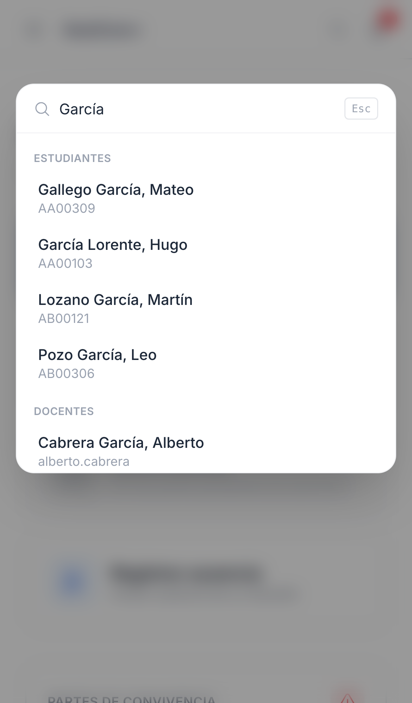
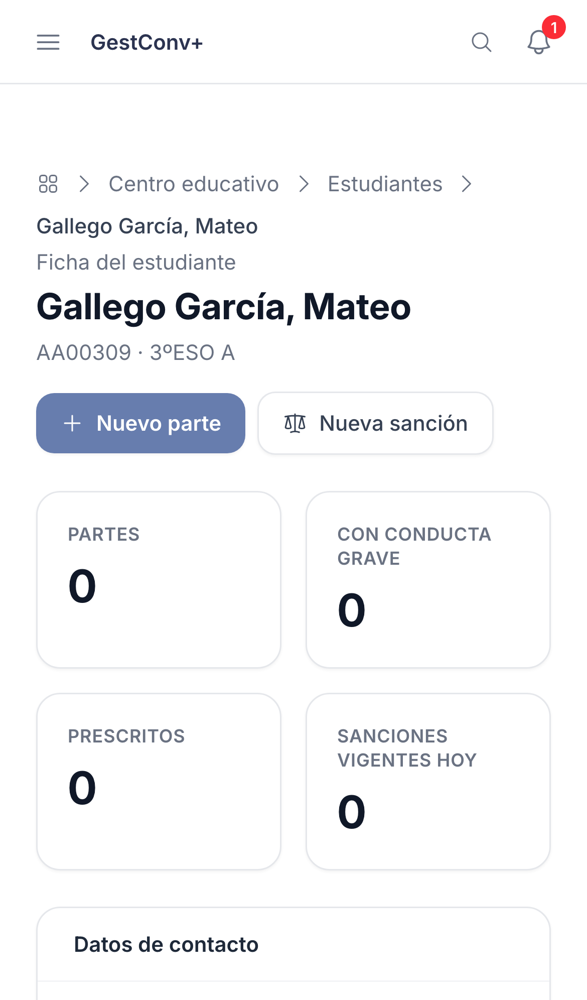

GestConv+ · Ficha rápida

# Buscar con la paleta de comandos

  1
  

    
Toca la lupa del encabezado —o pulsa <strong>⌘K</strong> / <strong>Ctrl+K</strong> en el ordenador— desde cualquier pantalla.

    
  

  2
  

    
Sin escribir nada ya tienes accesos directos: nuevo parte, notificaciones y cambio de curso.

    
  

  3
  

    
Escribe al menos 2 letras del nombre: aparecen estudiantes y, si eres del equipo directivo, también docentes.

    
  

  4
  

    
Toca un resultado para ir directo a su ficha.

    
  

  
Pulsa <strong>Esc</strong> para cerrar la búsqueda en cualquier momento. El grupo de docentes solo aparece para administración y equipo directivo; el resto del profesorado únicamente puede buscar estudiantes.

