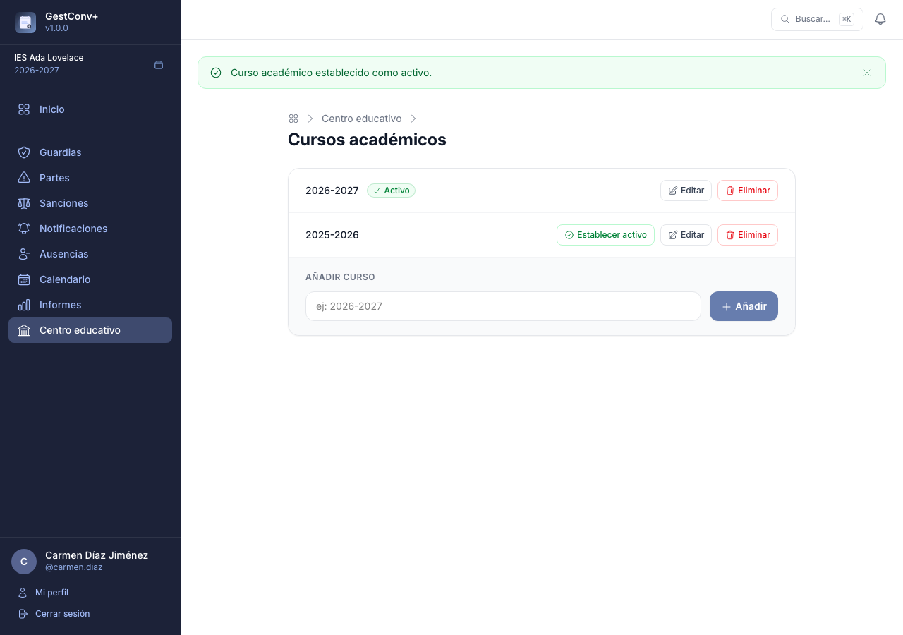
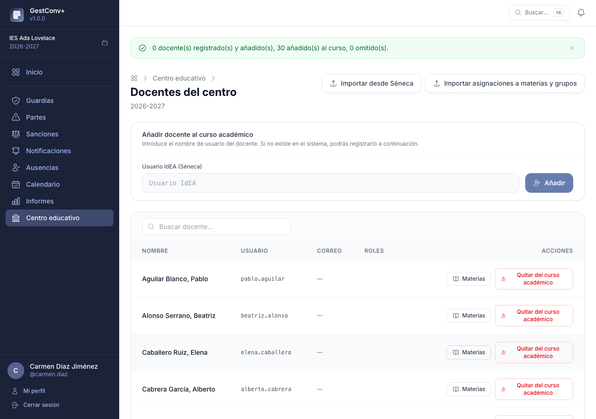
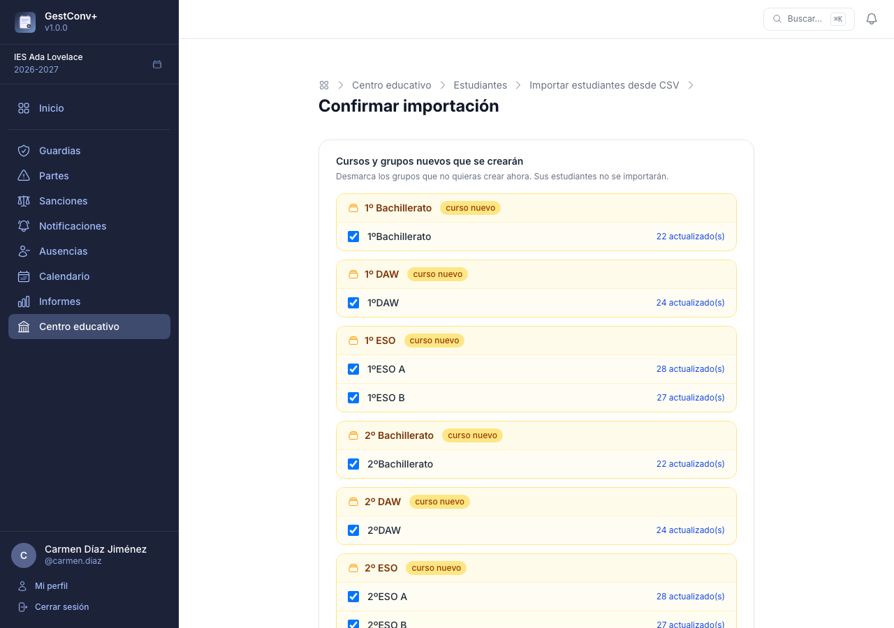
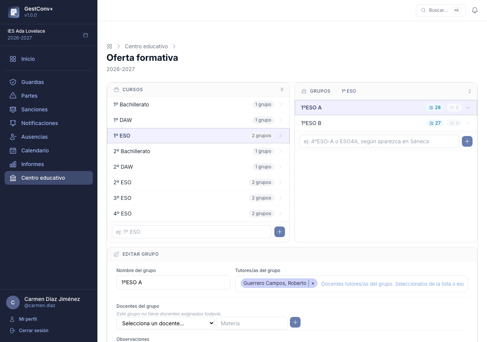
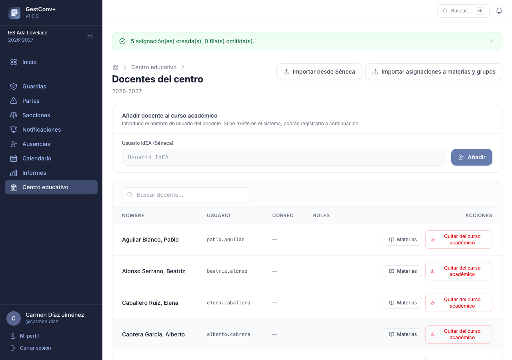
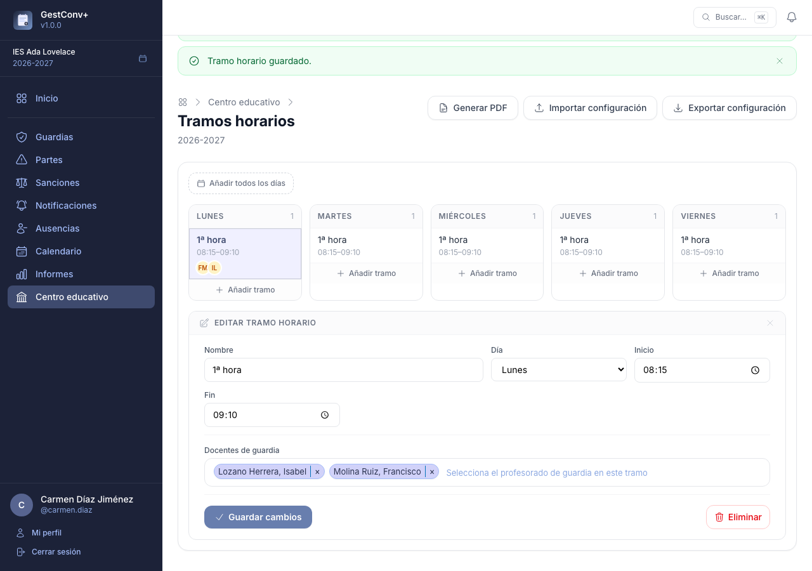
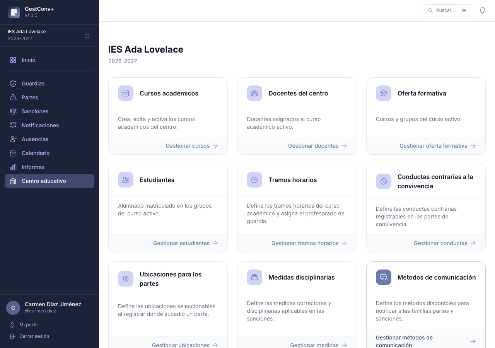

GestConv+ · Ficha rápida · Equipo directivo

# Configurar un curso académico nuevo

  1
  

Crear y activar el curso académico.

  2
  

Añadir el profesorado (importación desde Séneca).

  3
  

Importar el alumnado — crea solos los cursos y grupos.

  4
  

Asignar las tutorías de cada grupo.

  5
  

Importar quién imparte clase en cada grupo (opcional).

  6
  

Definir los tramos horarios y el profesorado de guardia.

  7
  

Revisar conductas, medidas, ubicaciones, métodos de comunicación y
  perfiles de comisión/orientación.

  
Con los ficheros de Séneca a mano, todo el proceso lleva menos de media hora y se repite
  una vez al año, al abrir cada curso nuevo. Detalle completo en el capítulo «Preparar el
  curso académico» del manual.

---

GestConv+ · Ficha rápida · Equipo directivo

# 1. Crear y activar el curso académico

  1
  

    
Desde <strong>Centro educativo › Cursos académicos</strong>, crea el curso nuevo (por
    ejemplo, <strong>2026-2027</strong>) y márcalo como <strong>activo</strong>.

    
Solo puede haber un curso activo por centro: es el curso de referencia para las altas de
    estudiantes, la oferta formativa, los partes y las sanciones. Los cursos anteriores no se
    pierden — quedan disponibles como histórico.

    
  

---

GestConv+ · Ficha rápida · Equipo directivo

# 2. Añadir el profesorado

  1
  

    
Desde <strong>Centro educativo › Docentes › Importar desde Séneca</strong>, sube el CSV
    que exporta Séneca (perfil de Dirección: <strong>Personal › Personal del centro › Exportar
    datos</strong>).

    
La aplicación crea los docentes que no existan y añade al curso activo tanto los recién
    creados como los que ya existieran, sin modificar sus datos. Se aceptan ficheros en UTF-8 y
    en Windows-1252.

    
  

---

GestConv+ · Ficha rápida · Equipo directivo

# 3. Importar el alumnado

  1
  

    
Desde <strong>Centro educativo › Estudiantes › Importar CSV</strong>, sube el CSV de
    Séneca (perfil de Dirección: <strong>Alumnado › Alumnado del centro › Exportar datos</strong>).
    Aquí está el mayor ahorro de tiempo: <strong>crea automáticamente los cursos y grupos</strong>
    que aparecen en el fichero — no hace falta preparar nada antes.

    
Antes de confirmar nada, se muestra una <strong>vista previa</strong> con todo lo que se
    va a hacer; los cursos y grupos nuevos se pueden desmarcar si no interesa crearlos todavía.

    
  

---

GestConv+ · Ficha rápida · Equipo directivo

# 4. Asignar las tutorías de grupo

  1
  

    
Con el alumnado ya importado, desde <strong>Centro educativo › Oferta formativa</strong>
    selecciona cada grupo y asigna su tutor/a en el panel de detalle que aparece debajo.

    
Esta asignación determina, entre otras cosas, qué docentes ven los partes y sanciones de
    su grupo.

    
  

---

GestConv+ · Ficha rápida · Equipo directivo

# 5. Quién imparte clase en cada grupo (opcional)

  1
  

    
Desde <strong>Centro educativo › Docentes › Importar asignaciones a grupos</strong>,
    importa el CSV de Séneca (perfil de Dirección: <strong>Personal › Personal del centro ›
    Materia y grupos › Unidad: Cualquiera › Exportar datos</strong>). Es imprescindible haber
    importado antes el profesorado (paso 2).

    
  

  
La aplicación funciona sin este paso, pero los docentes sin ningún grupo asignado no verán
  las sanciones de sus estudiantes en la sección Inicio.

---

GestConv+ · Ficha rápida · Equipo directivo

# 6. Definir los tramos horarios

  1
  

    
Desde <strong>Centro educativo › Tramos horarios</strong>, define los tramos en los que se
    organiza la jornada (1ª hora, recreo, 2ª hora…) y quién está de guardia en cada uno. El botón
    <strong>Añadir todos los días</strong> crea el mismo tramo en los cinco días lectivos a la
    vez, para no repetir el alta cinco veces cuando el horario es igual toda la semana.

    
Al seleccionar un tramo se abre su formulario de edición, con un buscador de
    <strong>docentes de guardia</strong> que admite varios a la vez.

    
  

  
Hace falta esta configuración para que la sección «Guardias» funcione: sin tramos horarios
  no hay nada que asignar ni consultar.

---

GestConv+ · Ficha rápida · Equipo directivo

# 7. Revisar los catálogos del centro

  1
  

    
<strong>Centro educativo › Conductas contrarias</strong> — 19 conductas por defecto,
    basadas en la normativa de convivencia escolar de Andalucía.

  

  2
  

    
<strong>Centro educativo › Sanciones › Medidas disciplinarias</strong> — las medidas que
    se marcan al registrar una sanción.

  

  3
  

    
<strong>Centro educativo › Ubicaciones</strong> — los lugares donde puede ocurrir un
    incidente, para el campo «Dónde sucedió» de los partes.

  

  4
  

    
<strong>Centro educativo › Métodos de comunicación</strong> — cómo se notifica a las
    familias (llamada, correo, tutoría presencial…).

  

  
Los cuatro catálogos se configuran automáticamente con valores por defecto al dar de alta
  el centro, pensados para empezar a trabajar sin más preparación, y comparten la misma mecánica:
  cada elemento se puede activar o desactivar, reordenar y editar. Conviene revisarlos al menos
  una vez y adaptarlos al plan de convivencia del centro.

---

GestConv+ · Ficha rápida · Equipo directivo

# Resultado: el centro, listo para trabajar

  ✓
  

    
Con los pasos anteriores, el curso <strong>2026-2027</strong> queda activo, con su
    profesorado, alumnado, oferta formativa, tutorías, tramos horarios y catálogos revisados.
    Solo falta asignar los perfiles de comisión de convivencia y orientación (ver el capítulo
    «Administrar el centro educativo» del manual).

    
  

