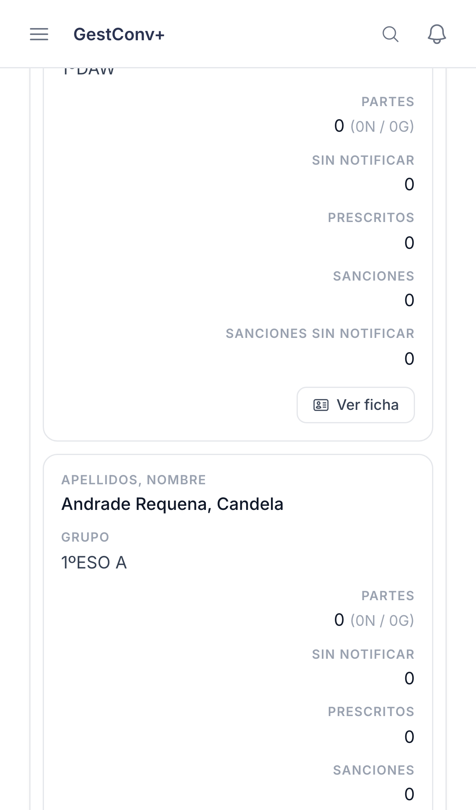
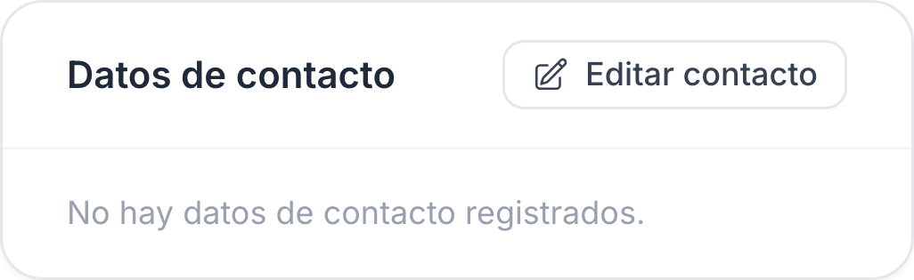
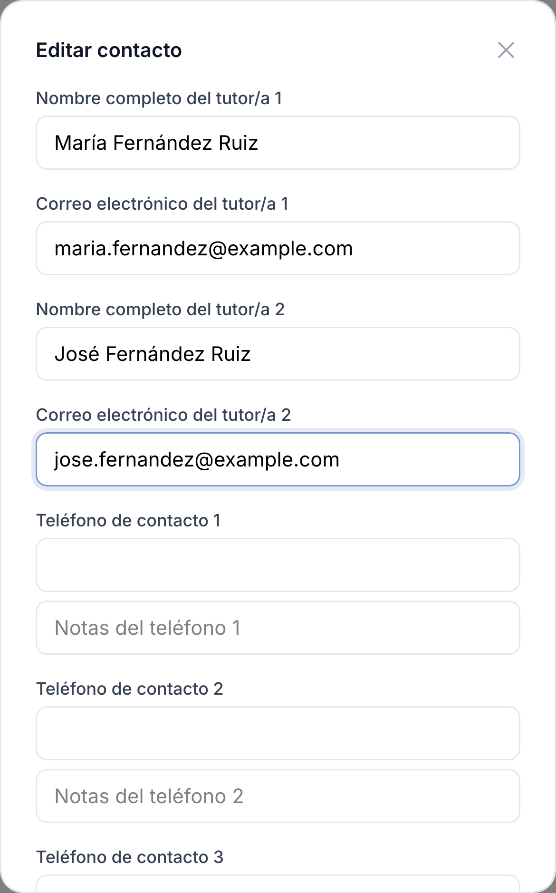
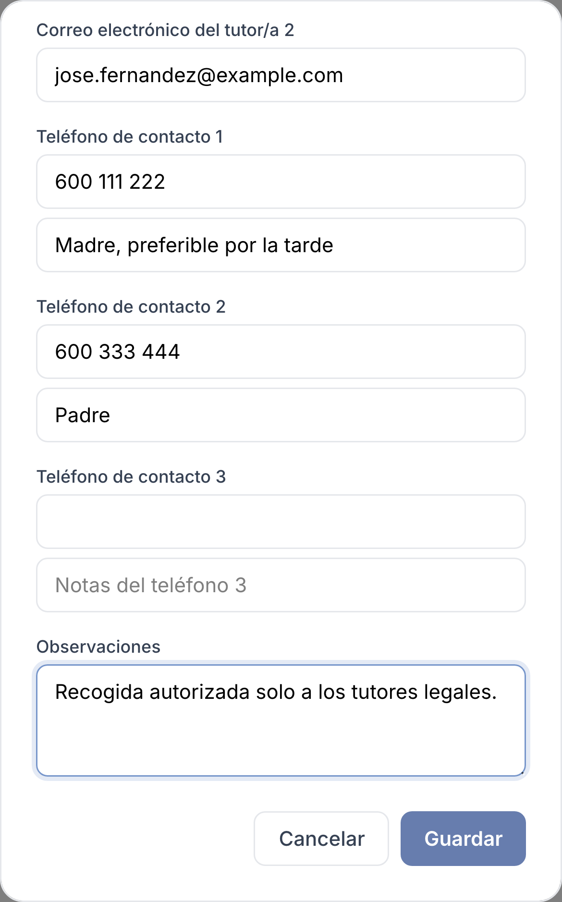
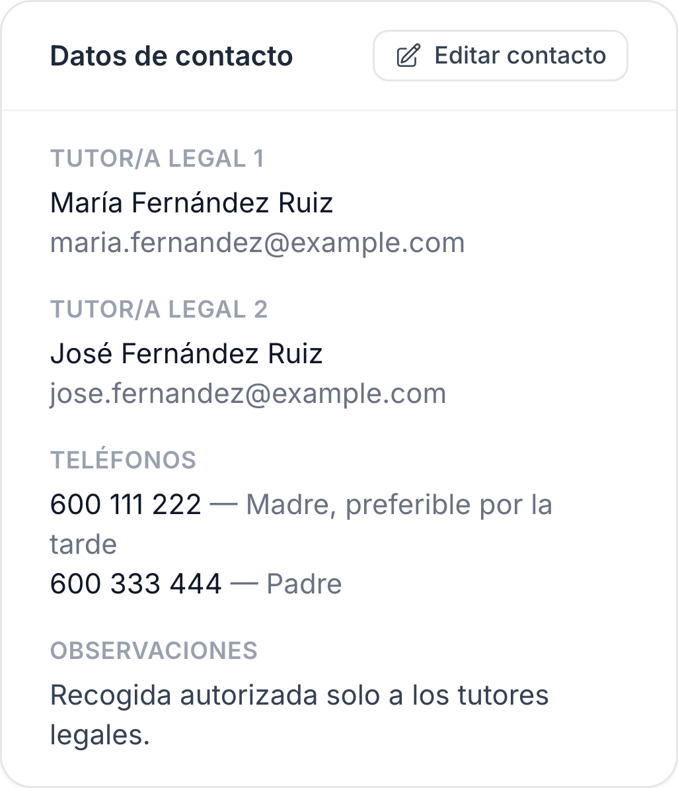

GestConv+ · Ficha rápida

# Editar los datos de contacto de un estudiante

  1
  

    
Ve a <strong>Mi tutoría</strong> y pulsa <strong>Ver ficha</strong> en el estudiante.

    
  

  2
  

    
En <strong>Datos de contacto</strong>, pulsa <strong>Editar contacto</strong>.

    
  

  3
  

    
Rellena nombre y correo de los tutores legales.

    
  

  4
  

    
Añade teléfonos de contacto, sus notas y observaciones.

    
  

  5
  

    
Pulsa <strong>Guardar</strong>: los datos quedan actualizados al momento.

    
  

  
Ven estos datos también los administradores, la comisión de convivencia y la orientación, pero solo tú, como tutor/a del grupo en el curso activo, puedes editarlos. Al consultar un curso académico distinto del activo la edición queda bloqueada.

