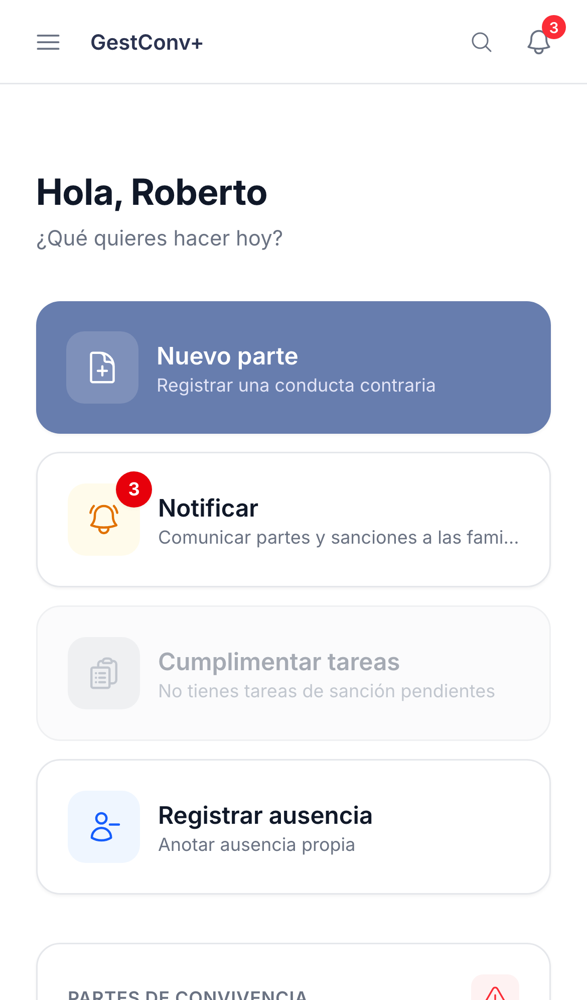

GestConv+ · Ficha rápida

# Añadir la app a la pantalla de inicio

  1
  

    
<strong>Android (Chrome):</strong> abre GestConv+ como siempre, con la misma dirección de tu centro.

    <ol>
      <li>Toca el menú  (arriba a la derecha).</li>
      <li>Elige <strong>Instalar aplicación</strong> o <strong>Añadir a pantalla de inicio</strong> (o acepta el aviso que ofrece Chrome directamente).</li>
      <li>Confirma. El icono aparece en tu pantalla de inicio.</li>
    </ol>
  

  2
  

    
<strong>iPhone/iPad (Safari):</strong> imprescindible usar Safari — ningún otro navegador puede hacerlo en iOS.

    <ol>
      <li>Toca el icono de <strong>compartir</strong> .</li>
      <li>Elige <strong>Añadir a pantalla de inicio</strong> en la lista de opciones.</li>
      <li>Confirma el nombre y toca <strong>Añadir</strong>.</li>
    </ol>
  

  3
  

    
Así queda: pantalla completa, sin barra de direcciones ni menús del navegador, con su propio icono junto al resto de tus apps.

    
  

  
No hace falta ninguna tienda de aplicaciones: es la misma web de siempre, solo que se abre como una app aparte. Se actualiza sola y tu sesión se mantiene igual que en el navegador.

