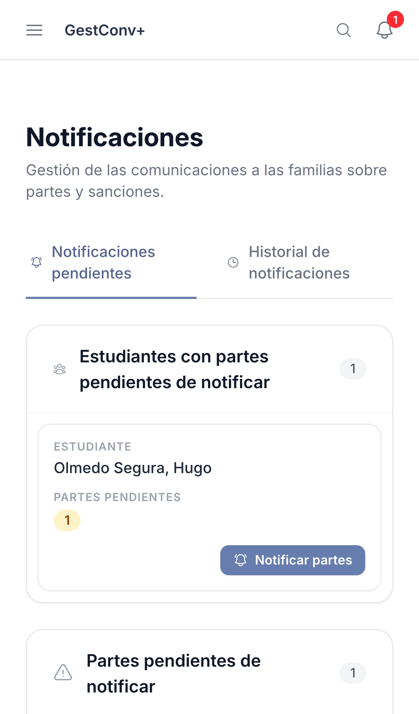
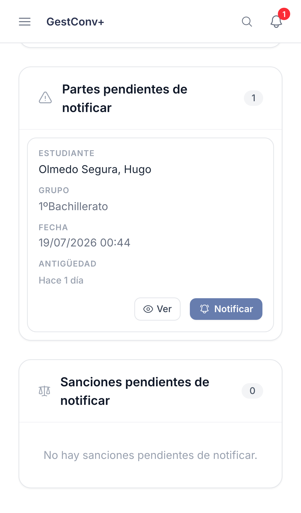
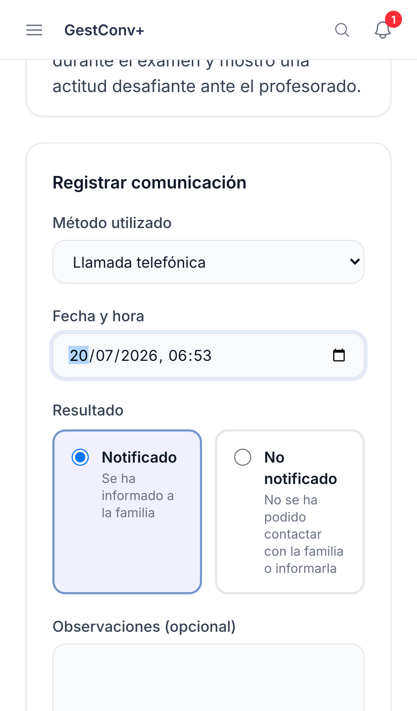
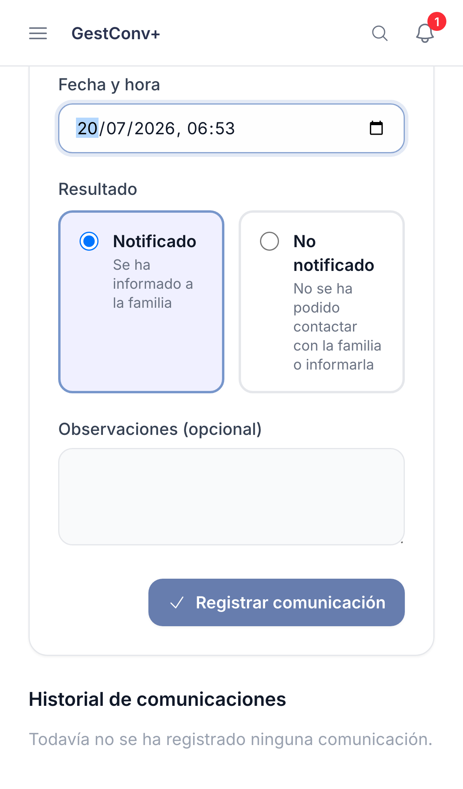

GestConv+ · Ficha rápida

# Notificar un parte

  1
  

    
Ve a <strong>Notificaciones → Pendientes</strong>. Los más atrasados se destacan en ámbar y en rojo.

    
  

  2
  

    
Pulsa <strong>Notificar</strong> en la fila del parte, o <strong>Notificar partes</strong> para avisar de varios del mismo estudiante a la vez.

    
  

  3
  

    
Elige el <strong>método</strong> utilizado y la <strong>fecha y hora</strong> del contacto.

    
  

  4
  

    
Marca el <strong>resultado</strong> (Notificado / No notificado) y guarda. Queda constancia en el historial.

    
  

  
La primera comunicación con resultado <strong>Notificado</strong> desbloquea el parte para poder incorporarlo a una sanción. Los intentos posteriores quedan igualmente en el historial.

