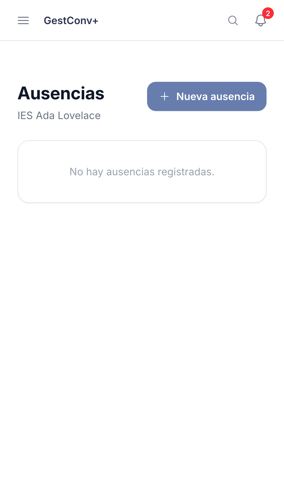
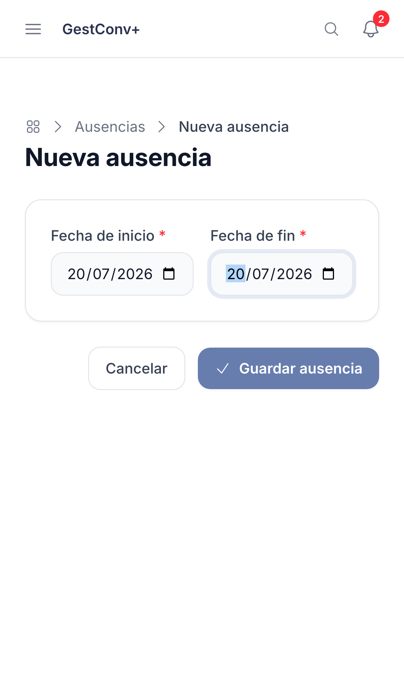
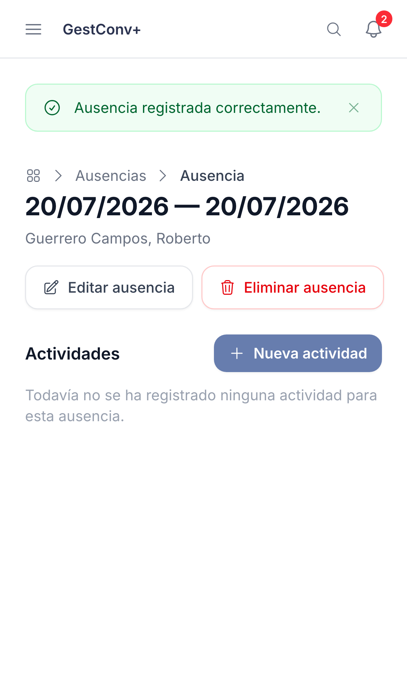
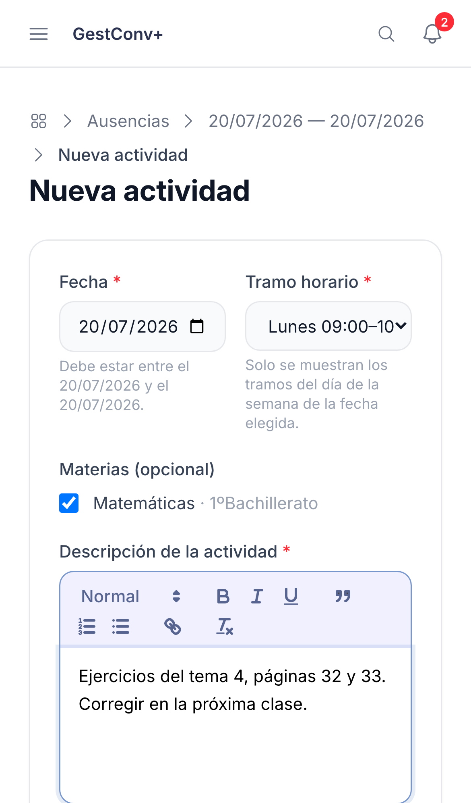
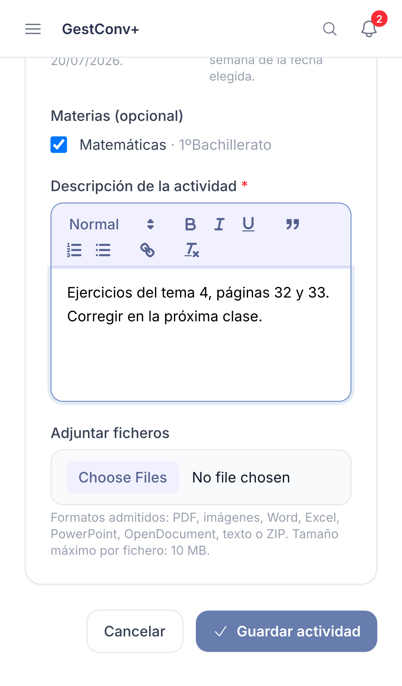

GestConv+ · Ficha rápida

# Registrar una ausencia

  1
  

    
Ve a <strong>Ausencias</strong> y pulsa <strong>Nueva ausencia</strong>.

    
  

  2
  

    
Indica la <strong>fecha de inicio</strong> y la <strong>fecha de fin</strong> del periodo ausente y guarda.

    
  

  3
  

    
Desde el detalle, pulsa <strong>Nueva actividad</strong> por cada clase afectada.

    
  

  4
  

    
Elige <strong>fecha, tramo horario y grupo</strong>, y describe las instrucciones para quien cubra la clase.

    
  

  5
  

    
<strong>Adjunta material</strong> si hace falta (hasta 10 MB por fichero) y guarda la actividad.

    
  

  
Una ausencia es privada: solo tú puedes editarla o eliminarla, y solo mientras no haya pasado su fecha de fin.

