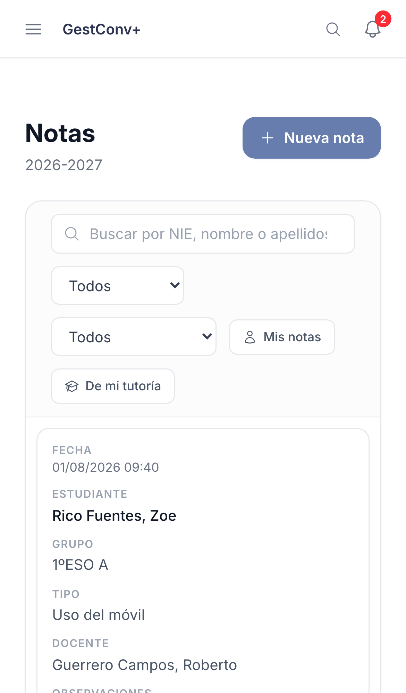
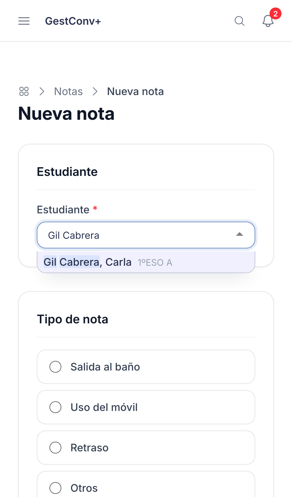
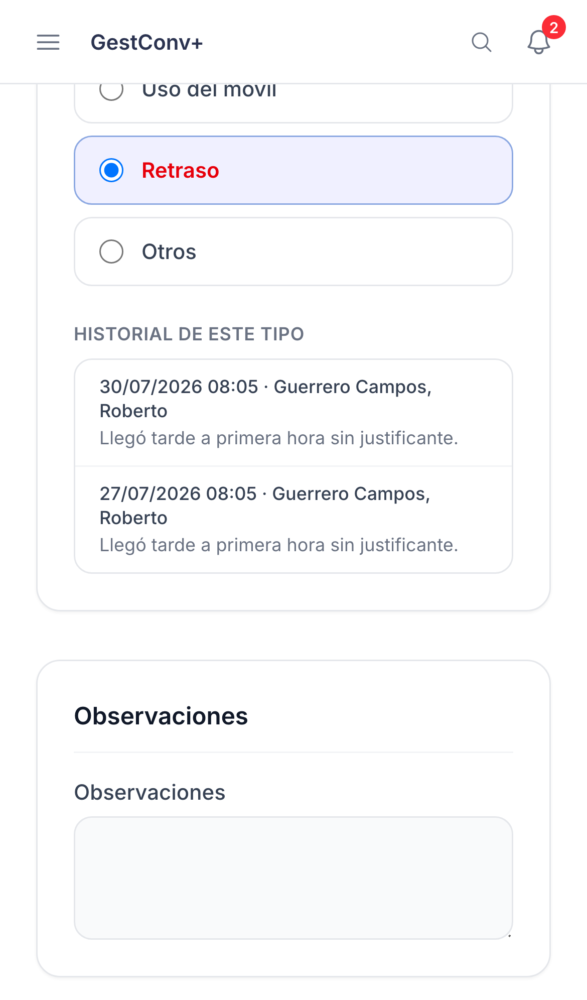
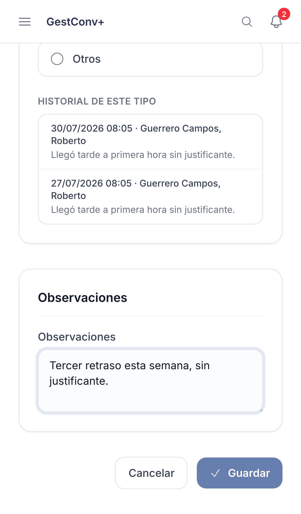
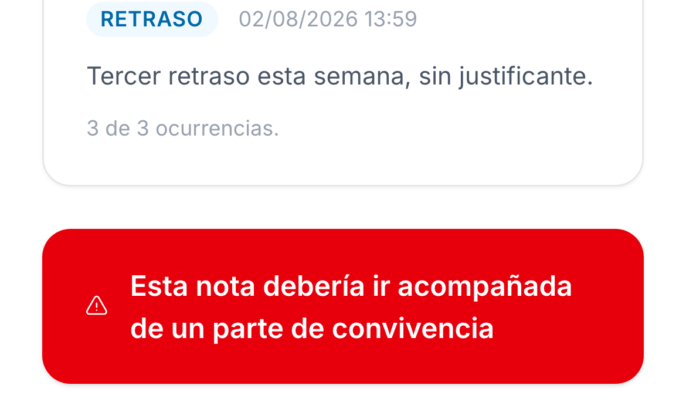

GestConv+ · Ficha rápida

# Registrar una nota

  1
  

    
Pulsa <strong>Nueva nota</strong> desde la sección <strong>Notas</strong> o la ficha del estudiante.

    
  

  2
  

    
<strong>Estudiante</strong>: busca por nombre o NIE. Una nota es siempre para un único estudiante.

    
  

  3
  

    
<strong>Tipo de nota</strong>: los que alcanzarían el umbral se resaltan en rojo; al elegir uno aparece su historial.

    
  

  4
  

    
Añade <strong>observaciones</strong> si hace falta (es opcional) y pulsa <strong>Guardar</strong>.

    
  

  5
  

    
Si se alcanza el umbral, la confirmación muestra un botón grande para <strong>registrar un parte</strong>.

    
  

  
Puedes editar las observaciones o eliminar tus propias notas durante los 30 minutos siguientes al registro. Pasado ese tiempo, solo un administrador puede modificarlas. Los tutores del grupo pueden marcar cualquier nota como <strong>ignorada</strong> para que deje de contar en el umbral.

