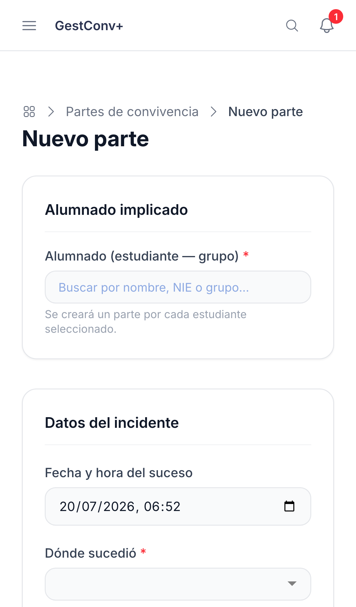
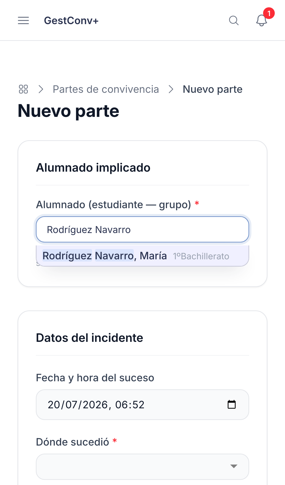
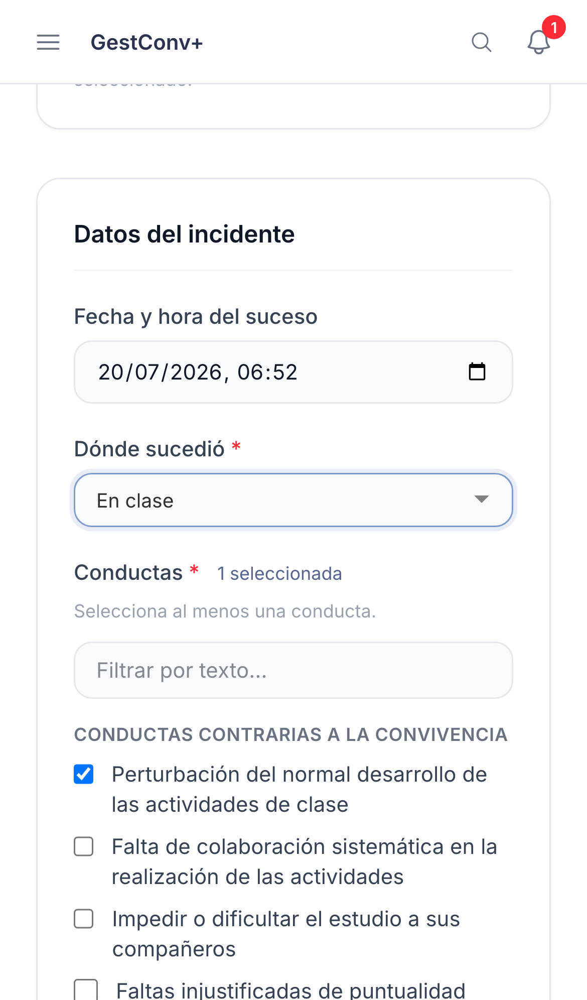
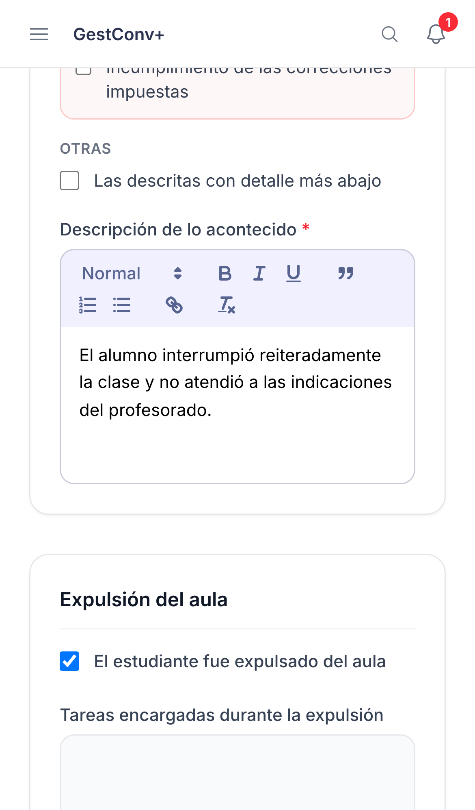
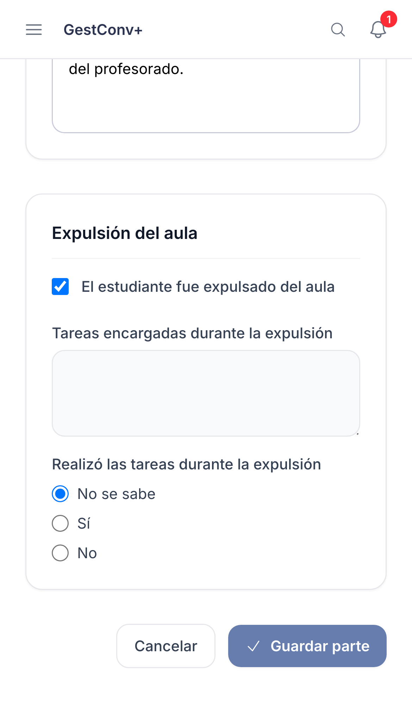

GestConv+ · Ficha rápida

# Registrar un parte

  1
  

    
Pulsa <strong>Nuevo parte</strong> desde el acceso rápido del inicio o la sección <strong>Partes</strong>.

    
  

  2
  

    
<strong>Alumnado implicado</strong>: busca por nombre o NIE. Si hay varios estudiantes, selecciónalos todos.

    
  

  3
  

    
Indica <strong>dónde</strong> sucedió y marca al menos una <strong>conducta</strong> del catálogo del centro.

    
  

  4
  

    
Describe lo sucedido y activa <strong>Expulsión del aula</strong> si corresponde.

    
  

  5
  

    
Pulsa <strong>Guardar parte</strong>. Desde la confirmación puedes notificar a la familia al momento.

    
  

  
Un parte sin comunicación a la familia no puede incorporarse a una sanción y, pasado un plazo, prescribe: notificarlo es la otra mitad del trabajo (ver la ficha «Notificar un parte»).

