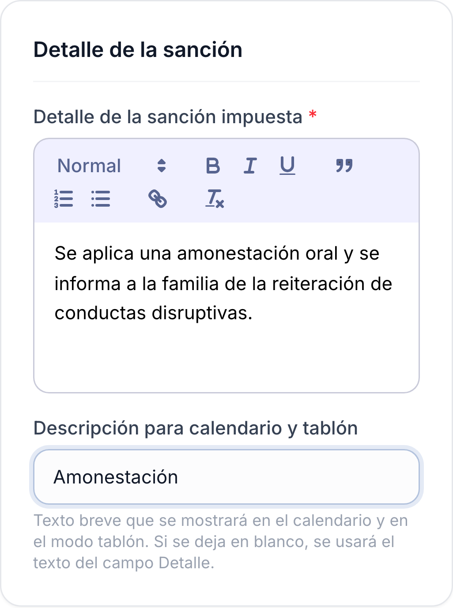
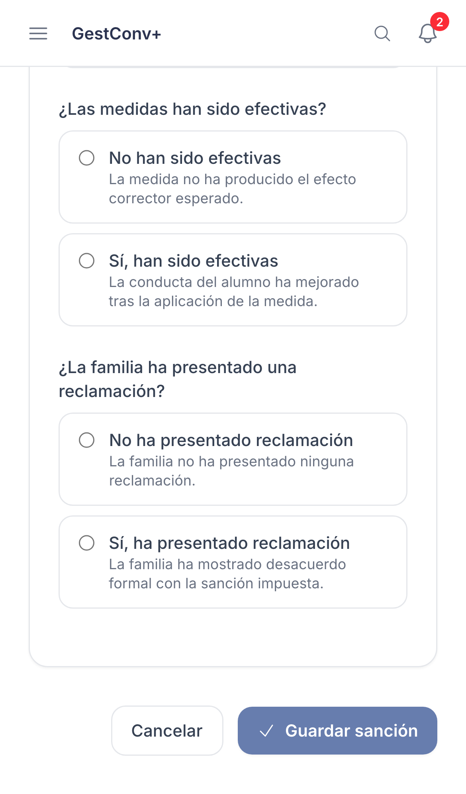

GestConv+ · Ficha rápida

# Registrar una sanción

  1
  

    
Ve a <strong>Sanciones</strong>, pulsa <strong>Nueva sanción</strong> y busca al estudiante: la tabla muestra cuántos partes sancionables, graves y prescritos tiene.

    
  

  2
  

    
Marca los <strong>partes implicados</strong> que motivan la sanción; un desplegable te deja consultar cada uno sin salir del formulario.

    
  

  3
  

    
En <strong>medidas disciplinarias</strong>, elige <strong>Sí</strong> y marca las aplicadas, o <strong>No</strong> e indica el motivo; si alguna tiene rango de fechas, rellena su vigencia.

    
  

  4
  

    
Redacta el <strong>detalle de la sanción</strong> y, si quieres, una descripción breve para el calendario y el tablón.

    
  

  5
  

    
Pulsa <strong>Guardar sanción</strong>. Desde el listado podrás comunicarla a la familia y completar su seguimiento.

    
  

  
Solo puede registrar sanciones la comisión de convivencia y quien administra el centro, y solo a partir de partes ya comunicados a la familia.

