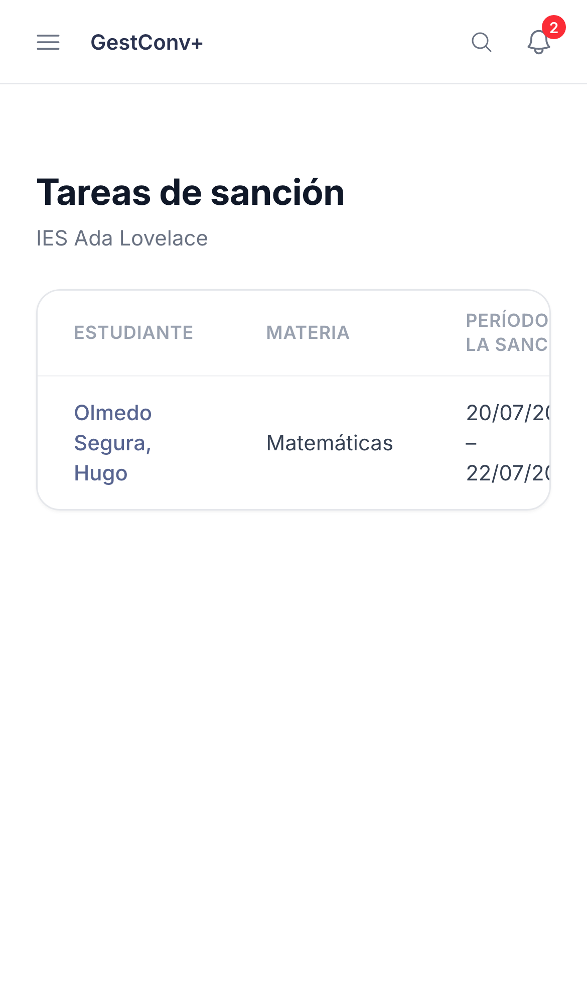
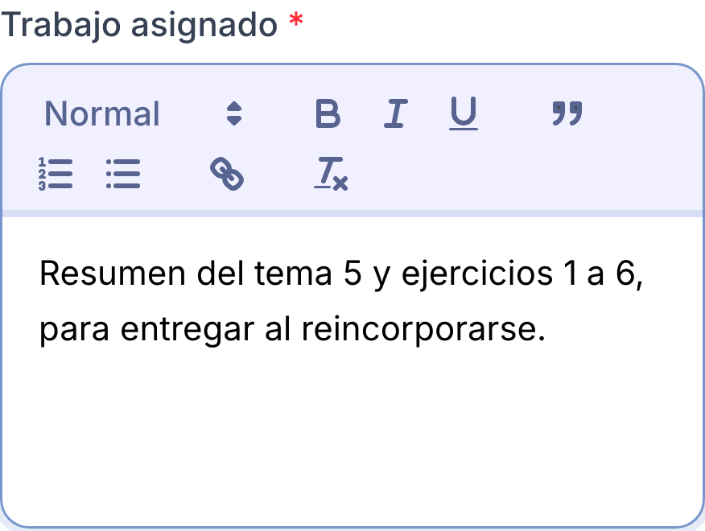
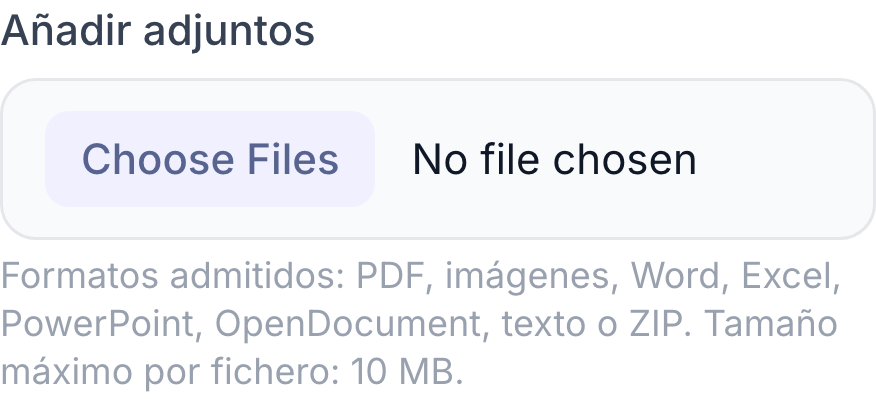
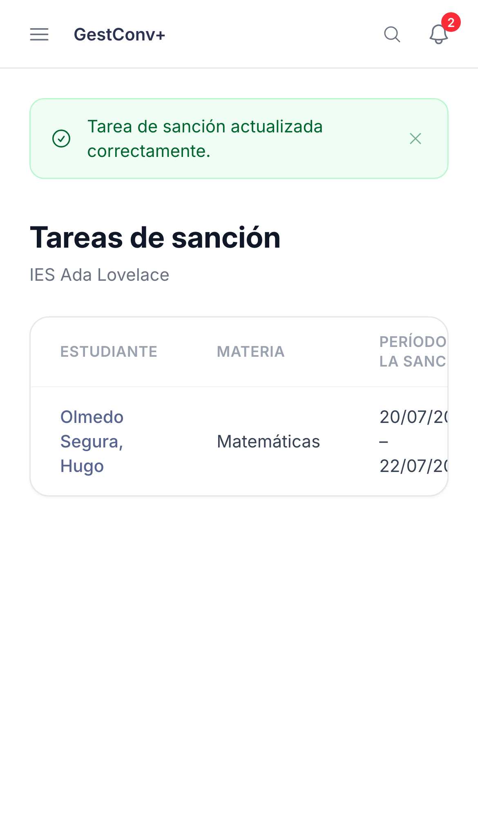

GestConv+ · Ficha rápida

# Cumplimentar tareas para una sanción

  1
  

    
Ve a <strong>Tareas de sanción</strong> y elige una tarea pendiente de la lista.

    
  

  2
  

    
Redacta el <strong>trabajo asignado</strong> para tu materia, o marca <strong>No procede</strong> si no corresponde dejar nada.

    
  

  3
  

    
<strong>Adjunta material</strong> si hace falta (hasta 10 MB por fichero).

    
  

  4
  

    
Guarda: la tarea queda <strong>cumplimentada</strong>, pero sigue siendo editable después sin límite de tiempo.

    
  

  
Solo ves y cumplimentas las tareas de tu propia materia; no tienes acceso al resto de datos de la sanción.

