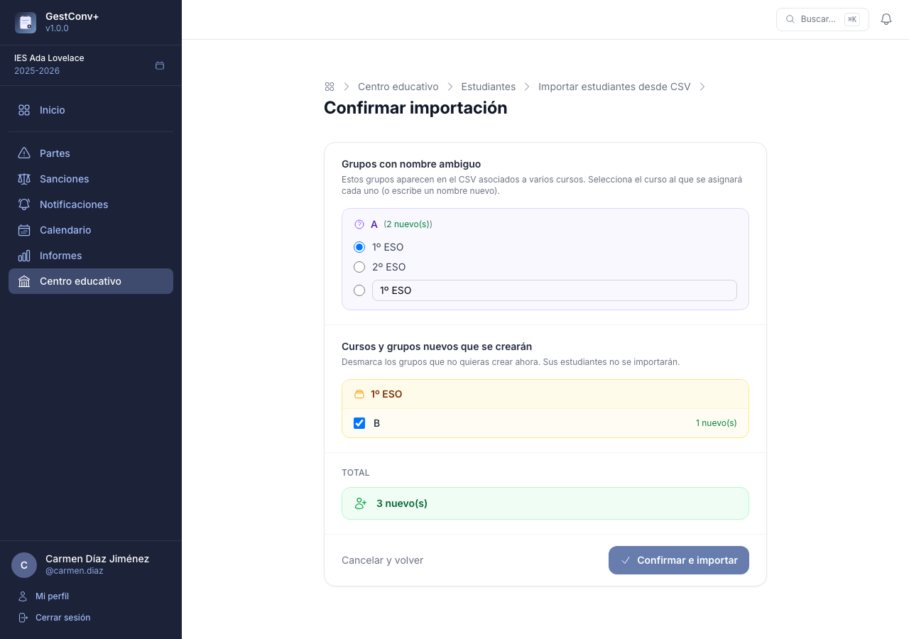

# Primeros pasos

## 1. Crear o activar el curso académico

Antes de nada, el centro necesita existir en la aplicación y tener un curso académico activo. Esto
lo hace un administrador o alguien del equipo directivo, normalmente una única vez por centro y 
luego una vez al año al abrir cada curso nuevo:

- **Primer arranque del servidor**: el comando `app:setup` (ver
  [Comandos de consola](08-comandos-de-consola.md)) crea el usuario `admin` si todavía no existe
  ningún docente en la base de datos, pero **no crea ningún centro educativo por defecto**. Tras
  iniciar sesión sin ningún centro todavía, la pantalla de selección de centro ofrece un enlace
  directo a **Administración › Centros › Nuevo centro**. Para probar la aplicación con un centro de
  demostración ya creado, usa `app:setup --demo-data`.
- **Nuevo centro**: un administrador global lo da de alta con
  `app:create-educational-centre <código> <nombre> <ciudad>` (o de forma interactiva, sin
  argumentos) o bien desde **Administración › Centros › Nuevo centro** en la propia aplicación.
- **Nuevo curso académico** en un centro ya existente: desde
  **Centro educativo › Cursos académicos**, un administrador de centro crea el curso siguiente y lo
  marca como activo. Solo puede haber un curso activo por centro; al activarlo se convierte en el
  curso de referencia para altas de estudiantes, oferta formativa, partes y sanciones.

## 2. Añadir los docentes del curso académico

Con el centro y el curso ya creados, el siguiente paso es dar de alta al profesorado. La vía
recomendada es la importación desde Séneca, disponible en
**Centro educativo › Docentes › Importar desde Séneca**:

- Se sube un CSV y la aplicación crea automáticamente los docentes que no existan (con
  autenticación externa vía IdEA) y añade al curso activo tanto los recién creados como los que ya
  existieran en el sistema, sin modificar los datos de estos últimos.
- Se aceptan ficheros en UTF-8 y en Windows-1252 (la codificación habitual de las exportaciones de
  Séneca).
- Se omiten las filas sin usuario IdEA o sin nombre en la columna «Empleado/a». Los docentes con
  fecha de cese también se importan.

También se puede añadir un docente de forma manual, uno a uno, desde el mismo apartado, sin
necesidad de fichero CSV — útil para altas puntuales durante el curso.

### Cómo exportar el CSV de Séneca (perfil Dirección)

En Séneca, con el perfil de Dirección: **Personal › Personal del centro › Exportar datos**
(formato CSV). El importador de GestConv+ usa las columnas «Empleado/a» y «Usuario IdEA» de ese
fichero; el resto de columnas se ignoran.

## 3. Estructurar la oferta formativa del curso académico

La oferta formativa es el catálogo de **cursos y grupos** del centro para el año activo (por
ejemplo: «1º ESO» con sus grupos «1ºESO-A» y «1ºESO-B»). Cada grupo pertenece a un único curso. 
Se gestiona desde **Centro educativo › Oferta formativa**, con un editor en dos columnas: la 
izquierda muestra los cursos; al seleccionar uno, la derecha muestra sus grupos. Al seleccionar un 
grupo o un curso, aparece su formulario de edición debajo. Los cambios se aplican al instante, sin
recargar la página.

Hay dos formas de crear la oferta formativa:

- **Importando el alumnado desde Séneca** — la opción más rápida: los cursos y grupos se crean automáticamente a partir de las columnas `Curso` y `Unidad` del CSV (ver paso 5).
- **Manualmente** — creando los cursos uno a uno desde el editor. Cuidado: el nombre de los grupos debe coincidir exactamente con las unidades que aparecen en Séneca para que la asignación de estudiantes funcione correctamente.

### Cómo registrarla manualmente, paso a paso

1. Pulsa «Añadir» bajo la lista de cursos para crear uno nuevo (por ejemplo, «1º ESO»).
2. Selecciona el curso recién creado; la columna derecha muestra sus grupos (vacía al principio).
3. Pulsa «Añadir» en la sección de grupos para crear los grupos del curso (por ejemplo, 1ºESO-A, 1ºESO-B).
4. Al seleccionar un grupo, aparece su formulario de edición: aquí se asignan tutores y docentes.

### Asignación de tutorías de grupo

Una vez tenemos los grupos conviene asignar qué docentes ejercen las tutorías de cada uno. Esta asignación determina, 
entre otras cosas, qué docentes verán los partes y sanciones de su grupo (ver [Roles y permisos](03-roles-y-permisos.md)). 

La asignación se realiza de forma manual desde el panel de detalle del grupo que aparece al 
seleccionar un grupo en la oferta formativa, justo debajo de las tablas de cursos y grupos.

## 4. Dar de alta a los estudiantes

El siguiente paso es importar el alumnado del curso, desde
**Centro educativo › Estudiantes › Importar CSV**, si no se
ha hecho ya al crear la oferta formativa.

Para ello se sube el fichero CSV exportado de Séneca. La
aplicación muestra un resumen de los cambios que va a realizar (altas, actualizaciones y grupos no
encontrados) y, tras confirmar, crea o actualiza los estudiantes y los asigna a sus grupos. Igual
que en los pasos anteriores, se aceptan ficheros en UTF-8 y en Windows-1252.

### Cómo exportar el CSV de Séneca (perfil Dirección)

En Séneca, con el perfil de Dirección: **Alumnado › Alumnado del centro › Exportar datos**
(formato CSV).

### Formato del CSV de importación

El importador lee directamente el fichero CSV que genera Séneca sin necesidad de modificarlo.

**Columnas obligatorias** (el fichero debe contenerlas; si falta alguna, la importación se cancela):

| Columna Séneca | Dato importado |
|---|---|
| `Estado Matrícula` | Filtro: filas con valor no vacío se omiten |
| `Nº Id. Escolar` | NIE del estudiante (identificador único) |
| `Nombre` | Nombre |
| `Primer apellido` | Primer apellido |
| `Segundo apellido` | Segundo apellido |
| `Unidad` | Nombre del grupo |
| `Curso` | Nombre del curso al que pertenece el grupo |

Si el grupo (`Unidad`) o el curso (`Curso`) no existen todavía en la oferta formativa del año activo, **se crean automáticamente** durante la importación. La vista previa los identifica claramente y permite desmarcar los que no quieras crear en ese momento.

Si el mismo nombre de grupo aparece en el CSV asociado a varios cursos distintos (caso poco frecuente), la vista previa muestra una sección especial donde debes elegir a qué curso se asignará ese grupo; también puedes escribir un nombre de curso diferente si lo prefieres.

**Columnas opcionales** (se importan si están presentes en el fichero; si no, ese campo se deja sin cambios en registros existentes):

| Columna(s) Séneca | Campo en la aplicación |
|---|---|
| `Nombre Primer tutor` + `Primer apellido Primer tutor` + `Segundo apellido Primer tutor` | Nombre completo del tutor/a 1 |
| `Correo Electrónico Primer tutor` | Correo electrónico del tutor/a 1 |
| `Teléfono Primer tutor` | Teléfono de contacto 1 |
| `Nombre Segundo tutor` + `Primer apellido Segundo tutor` + `Segundo apellido Segundo tutor` | Nombre completo del tutor/a 2 |
| `Correo Electrónico Segundo tutor` | Correo electrónico del tutor/a 2 |
| `Teléfono Segundo tutor` | Teléfono de contacto 2 |
| `Teléfono` | Teléfono de contacto 3 (teléfono del estudiante) |
| `Observaciones de la matrícula` | Observaciones |

El nombre de los tutores se compone automáticamente en formato «Apellido1 Apellido2, Nombre».

Si el NIE ya existe en la base de datos, se actualizan el nombre completo y todos los campos opcionales que estén presentes en el CSV.

## 5. Asignar docentes a los grupos (opcional)

El último paso es opcional y consiste en indicar el profesorado que imparte
clase en cada grupo. 

Esta asignación determina qué docentes verán los sanciones de cada grupo (ver [Roles y permisos](03-roles-y-permisos.md)). 

La vía recomendada es la importación desde Séneca, que se utiliza en la sección
de la aplicación 
**Centro educativo › Docentes › Importar asignaciones a grupos**:

- Se usan las columnas «Unidad» (grupo) y «Profesor/a» (nombre en formato «Apellidos, Nombre») del
  CSV.
- El docente se busca por nombre y apellidos exactos, y el grupo por nombre exacto entre los del
  curso activo; los que no coincidan se listan como no encontrados y esa fila se omite.
- Es imprescindible haber importado antes el listado de docentes del centro (paso 2), para que los
  nombres del CSV de asignaciones puedan encontrarse.

!!! note "Opcionalidad de la asignación de docentes a grupos"
    La asignación de docentes a grupos no es obligatoria para que la aplicación funcione, pero sí
    recomendable: los docentes que no estén asignados a ningún grupo no verán las sanciones de sus
    estudiantes en la sección Inicio.

### Cómo exportar el CSV de asignaciones de Séneca (perfil Dirección)

En Séneca, con el perfil de Dirección: **Personal › Personal del centro › Materia y grupos ›
Unidad: Cualquiera › Exportar datos** (formato CSV).
