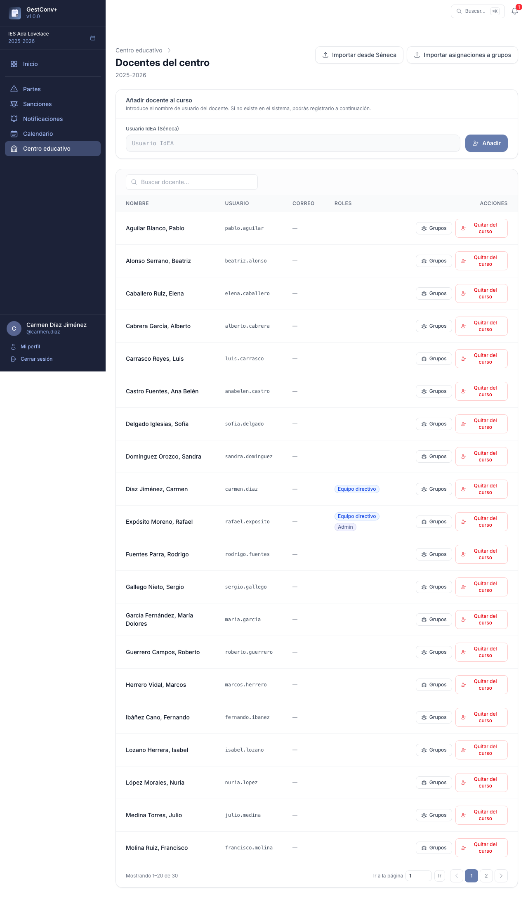
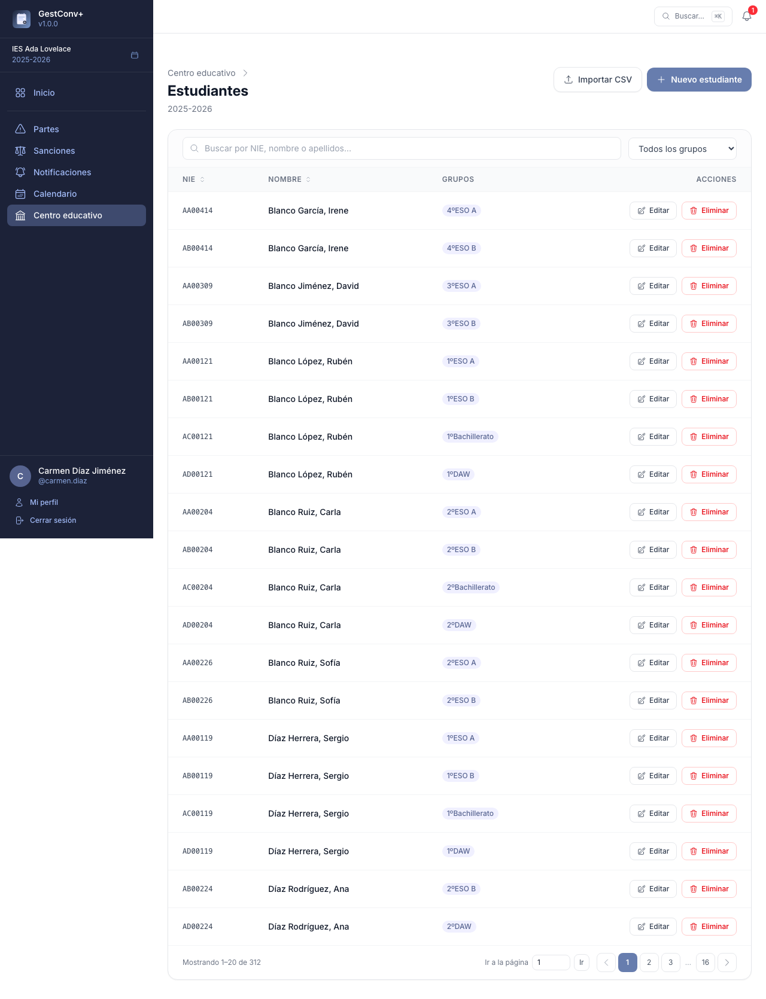

# Primeros pasos

## 1. Crear o activar el curso académico (administrador)

Antes de nada, el centro necesita existir en la aplicación y tener un curso académico activo. Esto
lo hace un administrador, normalmente una única vez por centro y luego una vez al año al abrir cada
curso nuevo:

- **Primer arranque del servidor**: el comando `app:setup` (ver
  [Comandos de consola](08-comandos-de-consola.md)) crea automáticamente un centro de demostración
  con su curso académico activo si todavía no existe ningún docente en la base de datos. Es la vía
  habitual para probar la aplicación o para el primer despliegue.
- **Nuevo centro**: un administrador global lo da de alta con
  `app:create-educational-centre <código> <nombre> <ciudad>` (o de forma interactiva, sin
  argumentos) o bien desde **Administración › Centros › Nuevo centro** en la propia aplicación.
- **Nuevo curso académico** en un centro ya existente: desde
  **Centro educativo › Cursos académicos**, un administrador de centro crea el curso siguiente y lo
  marca como activo. Solo puede haber un curso activo por centro; al activarlo se convierte en el
  curso de referencia para altas de estudiantes, oferta formativa, partes y sanciones.

## 2. Añadir los docentes del curso académico (equipo directivo)

Con el centro y el curso ya creados, el siguiente paso es dar de alta al profesorado. La vía
recomendada es la importación desde Séneca, disponible en
**Centro educativo › Docentes › Importar desde Séneca**:

- Se sube un CSV y la aplicación crea automáticamente los docentes que no existan (con
  autenticación externa vía IdEA) y añade al curso activo tanto los recién creados como los que ya
  existieran en el sistema, sin modificar los datos de estos últimos.
- Se aceptan ficheros en UTF-8 y en Windows-1252 (la codificación habitual de las exportaciones de
  Séneca).
- Se omiten las filas sin usuario IdEA o sin nombre en la columna «Empleado/a». Los docentes con
  fecha de cese también se importan.

También se puede añadir un docente de forma manual, uno a uno, desde el mismo apartado, sin
necesidad de fichero CSV — útil para altas puntuales durante el curso.

### Cómo exportar el CSV de Séneca (perfil Dirección)

En Séneca, con el perfil de Dirección: **Personal › Personal del centro › Exportar datos**
(formato CSV). El importador de GestConv+ usa las columnas «Empleado/a» y «Usuario IdEA» de ese
fichero; el resto de columnas se ignoran.

## 3. Estructurar la oferta formativa del curso académico (equipo directivo)

La oferta formativa es el árbol de **enseñanzas → niveles → grupos** del centro para el curso
activo (por ejemplo: ESO → 1º ESO → 1ºA). Se gestiona desde
**Centro educativo › Oferta formativa**, con un editor de tres columnas en el que se selecciona una
enseñanza para ver sus niveles, y un nivel para ver sus grupos; las altas, ediciones y bajas se
aplican al instante, sin recargar la página.

Si el centro ya tenía la oferta formativa configurada en un curso anterior, no hace falta
reconstruirla a mano: puede exportarse a JSON desde el curso de origen e importarse en el curso
nuevo (ver más abajo), incluyendo opcionalmente las asignaciones de tutores y docentes de grupo.

### Cómo registrarla, paso a paso

1. Selecciona una enseñanza existente o pulsa «Añadir» para crear una nueva (indicando su familia
   profesional).
2. Con la enseñanza seleccionada, añade sus niveles (por ejemplo, los cursos de un ciclo o de la
   ESO).
3. Con un nivel seleccionado, añade sus grupos (por ejemplo, 1ºA, 1ºB).
4. Desde el panel de detalle de cada enseñanza, nivel o grupo se edita su nombre y, según el caso,
   se asignan responsables: el coordinador de una enseñanza, los coordinadores de un nivel, o los
   tutores y docentes de un grupo.

Para clonar la oferta formativa de un curso o centro a otro sin repetir todo el proceso manual, usa
**Exportar JSON** en el curso de origen y **Importar JSON** en el curso de destino; el fichero JSON
es un formato propio de GestConv+ (no procede de Séneca) e incluye, si se marca la opción
correspondiente, las asignaciones de tutores y docentes de cada grupo.

## 4. Asignar tutores y docentes a los grupos (equipo directivo)

Una vez creados los grupos, hay que asignarles su tutor/a y el resto del profesorado que imparte
clase en ellos — esta asignación determina, entre otras cosas, qué docentes ven los partes y
sanciones de cada grupo (ver [Roles y permisos](03-roles-y-permisos.md)). La vía recomendada es la
importación desde Séneca, disponible en
**Centro educativo › Docentes › Importar asignaciones a grupos**:

- Se usan las columnas «Unidad» (grupo) y «Profesor/a» (nombre en formato «Apellidos, Nombre») del
  CSV.
- El docente se busca por nombre y apellidos exactos, y el grupo por nombre exacto entre los del
  curso activo; los que no coincidan se listan como no encontrados y esa fila se omite.
- Es imprescindible haber importado antes el listado de docentes del centro (paso 2), para que los
  nombres del CSV de asignaciones puedan encontrarse.

Igual que con los docentes, también se pueden asignar tutores y profesorado a un grupo de forma
manual desde el panel de detalle del grupo en la oferta formativa (paso 3).

### Cómo exportar el CSV de asignaciones de Séneca (perfil Dirección)

En Séneca, con el perfil de Dirección: **Personal › Personal del centro › Materia y grupos ›
Unidad: Cualquiera › Exportar datos** (formato CSV).

## 5. Dar de alta a los estudiantes (equipo directivo)

El último paso es importar el alumnado del curso, desde
**Centro educativo › Estudiantes › Importar CSV**. Se sube el fichero CSV exportado de Séneca, la
aplicación muestra un resumen de los cambios que va a realizar (altas, actualizaciones y grupos no
encontrados) y, tras confirmar, crea o actualiza los estudiantes y los asigna a sus grupos. Igual
que en los pasos anteriores, se aceptan ficheros en UTF-8 y en Windows-1252.

### Cómo exportar el CSV de Séneca (perfil Dirección)

En Séneca, con el perfil de Dirección: **Alumnado › Alumnado del centro › Exportar datos**
(formato CSV).

### Formato del CSV de importación

El importador lee directamente el fichero CSV que genera Séneca sin necesidad de modificarlo.

**Columnas obligatorias** (el fichero debe contenerlas; si falta alguna, la importación se cancela):

| Columna Séneca | Dato importado |
|---|---|
| `Estado Matrícula` | Filtro: filas con valor no vacío se omiten |
| `Nº Id. Escolar` | NIE del alumno (identificador único) |
| `Nombre` | Nombre |
| `Primer apellido` | Primer apellido |
| `Segundo apellido` | Segundo apellido |
| `Unidad` | Grupo (por nombre exacto) |

**Columnas opcionales** (se importan si están presentes en el fichero; si no, ese campo se deja sin cambios en registros existentes):

| Columna(s) Séneca | Campo en la aplicación |
|---|---|
| `Nombre Primer tutor` + `Primer apellido Primer tutor` + `Segundo apellido Primer tutor` | Nombre completo del tutor/a 1 |
| `Correo Electrónico Primer tutor` | Correo electrónico del tutor/a 1 |
| `Teléfono Primer tutor` | Teléfono de contacto 1 |
| `Nombre Segundo tutor` + `Primer apellido Segundo tutor` + `Segundo apellido Segundo tutor` | Nombre completo del tutor/a 2 |
| `Correo Electrónico Segundo tutor` | Correo electrónico del tutor/a 2 |
| `Teléfono Segundo tutor` | Teléfono de contacto 2 |
| `Teléfono` | Teléfono de contacto 3 (teléfono del alumno) |
| `Observaciones de la matrícula` | Observaciones |

El nombre de los tutores se compone automáticamente en formato «Apellido1 Apellido2, Nombre».

Si el NIE ya existe en la base de datos, se actualizan el nombre completo y todos los campos opcionales que estén presentes en el CSV.
