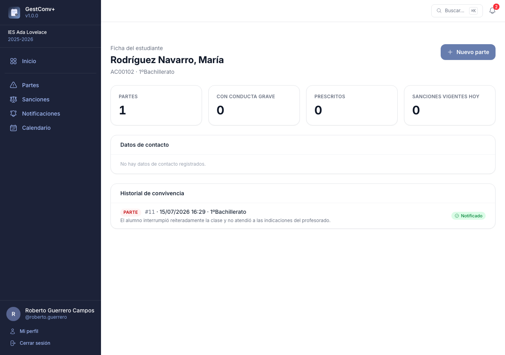
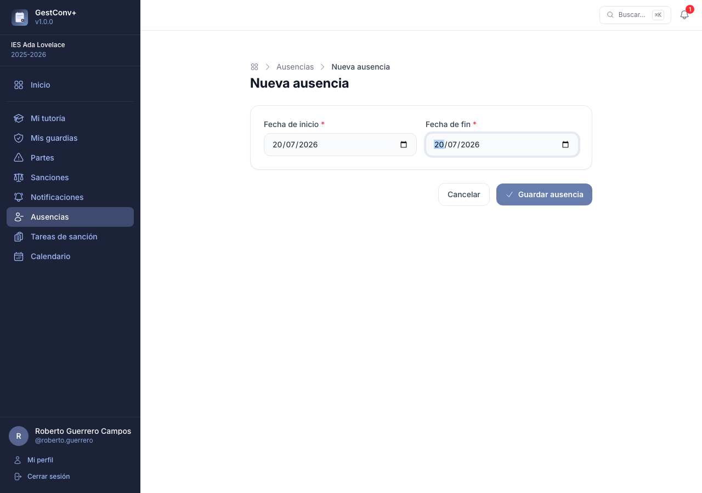
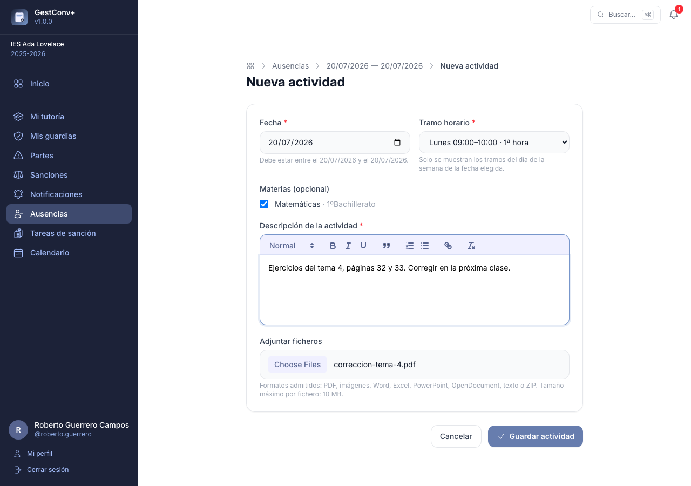
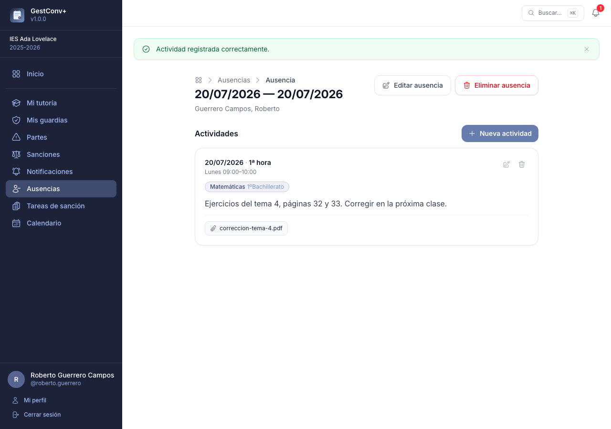
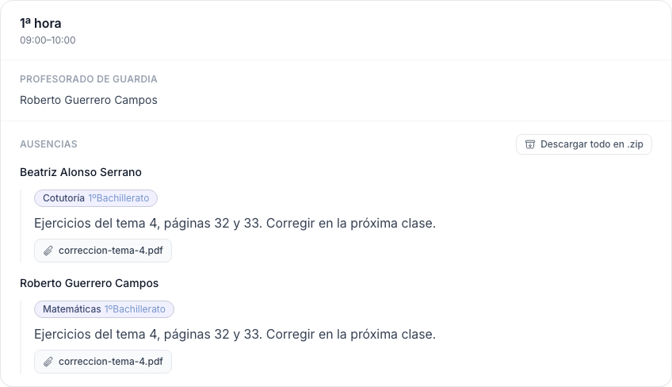
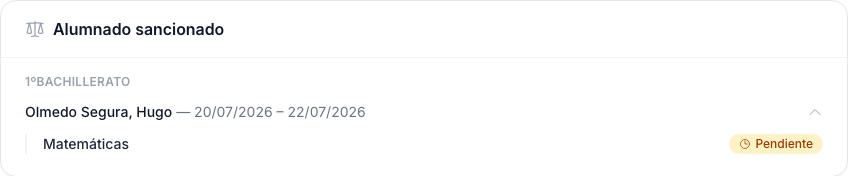
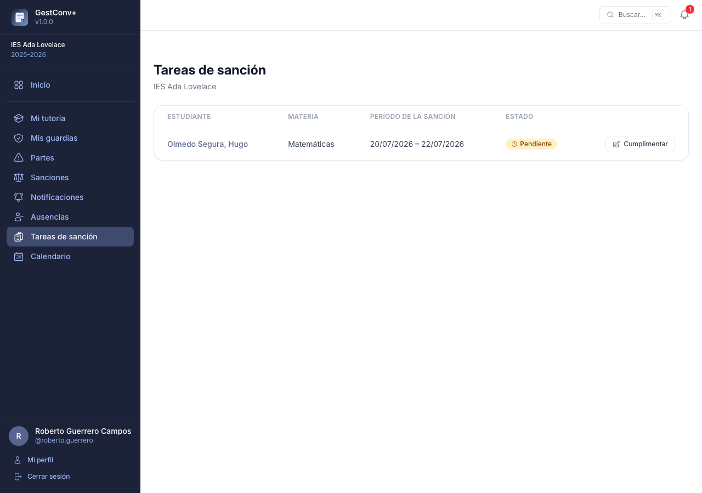
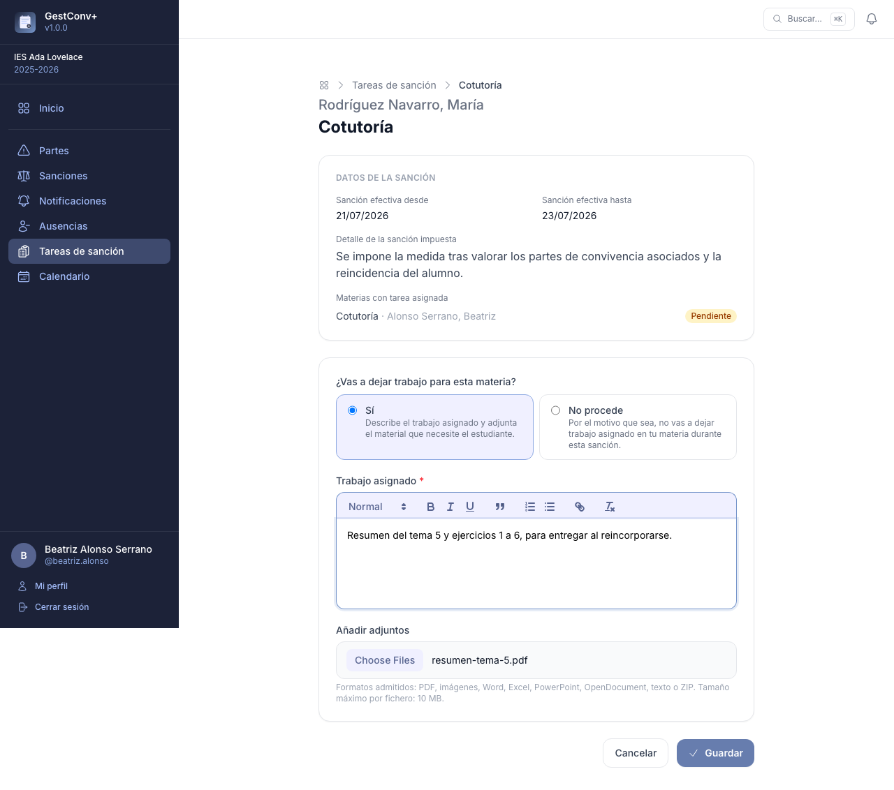
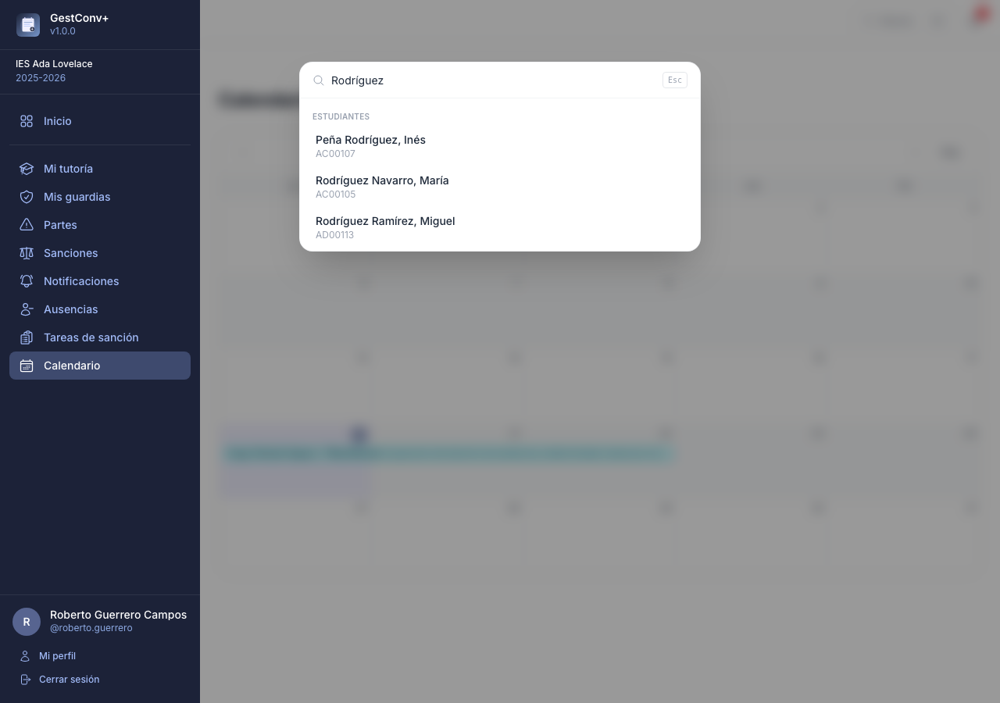

# El trabajo diario del profesorado

Este capítulo es para todo el profesorado: cómo moverse por la aplicación, registrar un parte de
convivencia cuando se produce un incidente, comunicarlo a la familia, consultar la trayectoria
de un estudiante y organizar el trabajo de las clases durante una ausencia. No hace falta ningún
permiso especial para nada de lo que se explica aquí.

!!! warning "La regla de oro"
    Un parte **sin comunicación a la familia no puede incorporarse a una sanción** y, pasado un
    plazo, prescribe. Registrar el parte es solo la mitad del trabajo: la otra mitad es dejar
    constancia de que la familia ha sido informada.

## La pantalla de inicio

El panel de inicio muestra un resumen del curso activo, adaptado al perfil de quien entra.

En la parte superior están los **accesos rápidos**: botones grandes pensados para el móvil, uno
por cada acción habitual, que solo aparecen para quien puede realizarlas:

- **Nuevo parte** — todo el profesorado.
- **Notificar** — con un contador en rojo si hay algo pendiente de comunicar; en gris y sin
  contador cuando no queda nada pendiente.
- **Nueva sanción** — solo quien puede registrar sanciones.
- **Cumplimentar tareas** — visible para cualquier docente con grupos de materia, con un contador
  de sus propias [tareas de sanción](#tareas-de-sancion) pendientes.
- **Registrar ausencia** — todo el profesorado.

Debajo, las tarjetas de estadísticas:

- **Partes de convivencia** — registrados en los últimos 30 días y accesibles para ese docente.
- **Sanciones vigentes** — sanciones en vigor en el día de hoy.
- **Partes próximos a prescribir** — partes sin notificar cuya prescripción automática está
  próxima, según el plazo configurado para el centro. Solo se muestra si esa función está
  activada en los ajustes.
- **Sanciones con materias pendientes** — visible para administradores, comisión de convivencia,
  orientación y tutores/as: cuántas sanciones del curso tienen alguna materia de [tareas de
  sanción](#tareas-de-sancion) sin cumplimentar. Enlaza al listado de sanciones con el filtro
  correspondiente ya aplicado.

A continuación, las **sanciones en vigor en tus grupos** de esta semana y la próxima, visible para
quien imparte materia en algún grupo.

Y por último:

- **Últimos partes** — los seis partes más recientes accesibles para el docente, cada uno con su
  estado (*Notificado* / *Pendiente de notificar*).
- **Alumnado con partes pendientes de sanción** — visible para administradores, comisión de
  convivencia y orientación: los estudiantes con más partes ya notificados y todavía sin sanción.
  Cada nombre enlaza con su [ficha del estudiante](#ficha-del-estudiante).
- **Tus grupos** — visible para los tutores/as sin los perfiles anteriores: sus grupos
  tutorizados y el número de estudiantes de cada uno.

Si el curso activo todavía no tiene estudiantado matriculado, las tarjetas se sustituyen por un
aviso con acceso directo a importar estudiantes (para quienes administran el centro).

### Cambio de curso académico (administradores)

Los administradores de centro y globales pueden consultar cursos académicos anteriores sin
modificar el curso activo, con el selector de curso de la cabecera del menú lateral. Al
visualizar un curso histórico, la aplicación muestra un aviso en ámbar y bloquea las operaciones
de escritura.

## Partes de convivencia

La sección **Partes** del menú lateral permite registrar y consultar los partes del curso activo.
Cada docente ve, como mínimo, los partes que ha registrado; las tutorías y los perfiles
especiales amplían esa visibilidad (ver [Permisos de un vistazo](08-permisos-de-un-vistazo.md)).

### Registrar un nuevo parte

1. Pulsa **Nuevo parte** en la esquina superior derecha de la sección o desde el acceso rápido
   del inicio.
2. **Alumnado implicado** — escribe el nombre o el NIE del estudiante en el campo de búsqueda; el
   desplegable muestra cada estudiante con su grupo. Si en el incidente participaron varios
   estudiantes (incluso de grupos distintos), selecciónalos todos: se creará un parte
   independiente para cada uno con los mismos datos.

   

3. **Fecha y hora del suceso** — por defecto se rellena con el momento actual; modifícala si el
   parte se registra después del incidente.
4. **Dónde sucedió** — campo obligatorio con el catálogo de lugares del centro
   (ver [Ubicaciones](06-administrar-el-centro.md#ubicaciones)), agrupados por categoría en el
   desplegable.
5. **Conductas** — marca al menos una conducta de las definidas para el centro. Están agrupadas
   en *Contrarias a la convivencia* y *Conductas graves*; los bloques de conductas graves se
   destacan con un recuadro rojo. Un campo de filtro sobre la lista oculta al instante las que no
   coinciden con el texto escrito (sin distinguir mayúsculas ni tildes) y un contador indica
   cuántas hay seleccionadas.
6. **Descripción de lo acontecido** — campo de texto obligatorio, con formato. Describe los
   hechos con detalle.
7. **Expulsión del aula** — elige **Sí** si el estudiante fue expulsado (por defecto está marcado
   **No**). Aparecerán dos campos adicionales: *Tareas encargadas durante la expulsión* y
   *¿Realizó las tareas?* (No se sabe / Sí / No).
8. Pulsa **Guardar parte**. Una pantalla de confirmación muestra los partes creados (uno por
   estudiante) con accesos directos para **notificar a la familia**, **crear otro parte** o
   **volver al listado**.

Los campos obligatorios están marcados con un asterisco; si falta alguno al guardar, cada error
se muestra junto al campo afectado.

> Cada parte queda vinculado al docente que lo registra. La fecha y hora de creación se registran
> automáticamente.

### Listado y filtros

El listado muestra los partes accesibles según el perfil, del más reciente al más antiguo, con
paginación. La primera columna (`#`) es el número de parte dentro del curso académico activo. Los
filtros disponibles son:

| Filtro | Descripción |
|---|---|
| Búsqueda libre | Busca por estudiante, docente, conducta o contenido de la descripción |
| Solo mis partes | Alterna entre ver solo los propios o todos los accesibles |
| Gravedad | Solo partes con conductas graves, solo contrarias, o todos |
| Expulsión | Solo partes con expulsión del aula |
| Rango de fechas | Filtra por fecha del suceso (desde / hasta) |

Cada fila muestra, junto a las conductas, una pastilla con el estado de notificación a la familia
(**Notificado** en verde, o **Pendiente de notificar** en ámbar con enlace directo para registrar
la comunicación si tienes permiso) y, si corresponde, otra pastilla **No sancionable** para los
partes prescritos, que se muestran atenuados en toda la fila.

En pantallas pequeñas, cada fila se muestra como una tarjeta con las etiquetas de campo visibles.

### Ver y editar un parte

Pulsa **Ver** en cualquier fila para abrir el detalle completo del parte. Cualquier docente con
acceso al parte puede añadir **observaciones**: anotaciones con la fecha y hora actuales, el
docente que las registra y un texto con formato. Se muestran en orden cronológico inverso, justo
antes del historial de comunicaciones. Quien registra una observación puede editarla o eliminarla
durante la hora siguiente; pasado ese plazo, solo un administrador puede hacerlo (y es el único
que puede corregir su fecha y hora).

Desde el detalle puedes **editar** el parte si eres quien lo registró o un administrador. El
número de parte (`#1`, `#2`…) es de solo lectura y no cambia al editar. En cuanto el parte se
comunica a la familia, solo un administrador puede seguir editando sus datos; quien lo registró
conserva la posibilidad de gestionar sus observaciones, pero no de modificar el resto de campos.

Los administradores pueden además **reasignar el docente y el estudiante** de un parte ya
registrado, y son los únicos que pueden **eliminarlo** definitivamente (una acción irreversible).

Mientras el parte esté pendiente de comunicar a la familia y no esté prescrito, quien tenga
permiso para notificarlo ve también un botón **Notificar** junto a los de editar y eliminar.

## Notificaciones

La sección **Notificaciones** del menú lateral tiene dos pestañas: **Notificaciones pendientes**,
la cola de partes y sanciones cuya familia todavía no ha sido informada, e **Historial de
notificaciones**, con todas las comunicaciones registradas en el curso activo.

Antes de las colas de partes y sanciones, la pestaña muestra los **estudiantes con partes
pendientes de notificar** (solo los que el docente puede notificar), ordenados de más a menos
partes. El botón **Notificar partes** de cada fila abre la pantalla de notificación en bloque
(ver más abajo).

Cada elemento de la cola muestra su **antigüedad** (los días transcurridos desde que se
registró), destacada en ámbar a partir de tres días y en rojo a partir de siete, para localizar
de un vistazo los más atrasados.

El botón **Notificar** solo aparece en los elementos que ese docente tiene permiso para comunicar
(ver [Quién puede notificar](#quien-puede-notificar)); el resto aparece igualmente en la lista,
sin acción disponible.

### Registrar una comunicación

Pulsa **Notificar** en la fila correspondiente para abrir el formulario de registro, común a
partes y sanciones.

Si el docente tiene permiso para verlos, la pantalla muestra también los **datos de contacto**
del estudiante (tutores legales, teléfonos y observaciones) justo antes del formulario. Quien
registró el parte o la sanción los ve siempre, aunque no sea tutor/a del grupo, para poder
contactar con la familia.

Para un parte, la pantalla incluye además todo su detalle —conductas, descripción, prescripción y
expulsión si las tiene— y sus observaciones, para poder comunicar a la familia todo lo acontecido
sin consultar el parte por separado.

1. **Método utilizado** — uno de los métodos de comunicación activos del centro.
2. **Fecha y hora** — por defecto, el momento actual.
3. **Resultado** — *Notificado* (la familia ha sido informada correctamente) o *No notificado*
   (no se ha podido contactar).
4. **Observaciones** — campo de texto opcional.

Al guardar se vuelve a la cola de notificaciones, lista para continuar con el siguiente elemento.

Cada intento queda registrado en el **historial**, se marque o no como notificado. La primera
comunicación con resultado *Notificado* es la que desbloquea el parte o la sanción; los intentos
posteriores se siguen añadiendo al historial pero no cambian ese estado.

El detalle de un parte o de una sanción muestra un indicador de estado (**Notificado** /
**Pendiente de notificar**) enlazado a esta pantalla de registro.

### Notificar varios partes a la vez

Desde el listado de **estudiantes con partes pendientes de notificar**, la pantalla **Notificar
partes** reúne todos los partes de ese estudiante que el docente puede notificar, cada uno con
una casilla (marcadas todas por defecto) y sus detalles desplegables. Los datos de la
comunicación (método, fecha y hora, resultado y observaciones) se rellenan una única vez y se
aplican a todos los partes marcados: se crea una comunicación independiente por cada uno, igual
que si se notificaran de uno en uno.

### Historial de notificaciones

La pestaña **Historial de notificaciones** reúne, en una única tabla paginada, todas las
comunicaciones registradas en el curso activo sobre partes y sanciones: fecha, estudiante, grupo,
tipo de elemento, método, docente, resultado y observaciones. Un enlace **Ver** lleva al parte o
sanción correspondiente. Puede filtrarse por texto libre, por tipo de elemento y por resultado.

Un docente sin permisos especiales solo ve las comunicaciones de los partes y sanciones que él
mismo registró o que pertenecen a un grupo del que es tutor/a. Los administradores, la comisión
de convivencia y orientación ven el historial completo del centro.

### Quién puede notificar

Un ajuste por centro determina, además de los administradores, quién puede registrar la
comunicación de un parte y de una sanción, de forma independiente: **quien lo registró**, **el
tutor/a del grupo**, o **ambos** (opción por defecto). Se configura en los ajustes del centro
(ver [Administrar el centro educativo](06-administrar-el-centro.md#ajustes-del-centro)).

## Ficha del estudiante

La ficha del estudiante reúne en una sola pantalla toda la información de convivencia de un
estudiante:

- **Datos básicos** — nombre y grupo.
- **Contadores** — partes registrados (indicando cuántos incluyen conductas graves y cuántos han
  prescrito) y sanciones vigentes hoy.
- **Datos de contacto** — tutores legales, teléfonos y observaciones. Solo visibles para los
  administradores, la comisión de convivencia, la orientación y los tutores/as del grupo. El
  tutor/a del grupo del estudiante en el curso activo puede además **editarlos**, con el botón
  **Editar contacto** que abre un formulario en un cuadro de diálogo; el resto de perfiles con
  acceso a estos datos solo puede consultarlos. La edición queda bloqueada mientras se consulta un
  curso académico distinto del activo y cada cambio se registra en el registro de actividad.
- **Historial de convivencia** — los partes y sanciones del estudiante en orden cronológico, cada
  uno con su estado de notificación. Cada docente ve solo los que le permiten sus permisos.
- **Accesos directos** para registrar un nuevo parte o una nueva sanción con el estudiante ya
  seleccionado.

Se llega a la ficha desde el buscador global, los listados y detalles de partes y sanciones, y la
lista *Alumnado con partes pendientes de sanción* del inicio.

## Mi tutoría

La sección **Mi tutoría** del menú lateral aparece para cualquier docente que sea tutor/a de al
menos un grupo en el curso académico visualizado, y reúne en una sola tabla todo el alumnado de
sus grupos tutorizados, ordenado por apellidos y nombre:

- **Apellidos, nombre** y **grupo** de cada estudiante.
- **Partes** — total de partes registrados, con el desglose entre normales (N) y graves (G) entre
  paréntesis.
- **Sin notificar** — partes todavía sin comunicar a la familia.
- **Prescritos** — partes que han prescrito por el paso del plazo.
- **Sanciones** y **Sanciones sin notificar**, con el mismo criterio que los partes.

Un buscador por nombre o apellidos y un desplegable de grupo permiten filtrar el listado, y
cualquier columna —incluidas las estadísticas— puede usarse para ordenar, alternando entre orden
creciente y decreciente. El botón **Ver ficha** de cada fila lleva a la
[ficha del estudiante](#ficha-del-estudiante), donde el tutor/a puede además editar sus datos de
contacto.

## Ausencias

La sección **Ausencias** del menú lateral permite a cualquier docente dejar organizado el trabajo
de sus grupos cuando sabe que va a faltar: qué debe trabajarse en cada clase afectada, con las
instrucciones y el material necesarios para quien la cubra.

Cada ausencia es un **rango de fechas** (por ejemplo, los días de una baja o de un permiso) y
contiene una o varias **actividades**: una por cada clase que se ve afectada, con su propio tramo
horario, grupo y descripción.

Una ausencia es **privada**: solo quien la registra puede editarla o eliminarla, y solo mientras no
haya pasado su fecha de fin (después queda **bloqueada** para ese docente, aunque sigue pudiendo
consultarla). Ningún otro docente tiene acceso a las ausencias de otra persona, ni siquiera si
comparte grupo con quien las registró. Los administradores globales y los de centro son la
excepción: tienen acceso completo —crear, consultar, editar y eliminar— a las ausencias de
cualquier docente del curso, sin que el bloqueo por fecha les afecte (ver
[Permisos de un vistazo](08-permisos-de-un-vistazo.md#ausencias)).

Si quien accede es administrador (global o de centro) y además pertenece al curso escolar
visualizado, la sección muestra dos pestañas:

- **Mis ausencias** — las propias, igual que para cualquier docente.
- **Ausencias del centro** — todas las registradas en el curso, con filtros por fecha (hoy o un
  rango) y por docente, ordenadas por fecha de fin de más reciente a más antigua. El filtro de
  docente solo ofrece a quienes tienen alguna ausencia registrada en el curso visualizado.

Un administrador que no pertenezca al curso (por ejemplo, solo administra el centro pero no da
clase) ve directamente el listado de ausencias del centro, sin pestañas.

### Registrar una ausencia

1. Pulsa **Nueva ausencia** en la esquina superior derecha del listado.
2. Si quien registra es administrador, elige primero el **docente** para el que se registra la
   ausencia (por defecto, uno mismo).
3. Indica la **fecha de inicio** y la **fecha de fin** del periodo en el que se estará ausente.
   Ambas son obligatorias y la fecha de fin no puede ser anterior a la de inicio.
4. Guarda: se abre el detalle de la ausencia, todavía sin actividades.

### Añadir actividades

Desde el detalle de la ausencia, pulsa **Nueva actividad** para indicar qué hacer en una de las
clases afectadas:

1. **Fecha** — debe estar dentro del rango de la ausencia; por defecto se sugiere la fecha de
   inicio de esta.
2. **Tramo horario** — uno de los tramos del centro cuyo día de la semana coincida con la fecha
   elegida; la lista se actualiza automáticamente al cambiar la fecha.
3. **Grupo o asignatura** (opcional) — puede marcarse más de uno de los grupos o asignaturas que
   imparte quien registra la actividad, si la misma instrucción sirve para varias clases del mismo
   tramo.
4. **Descripción** — instrucciones para quien cubra la clase, con formato de texto enriquecido.
   Es obligatoria.
5. **Adjuntar ficheros** (opcional) — fichas de trabajo, presentaciones u otro material de apoyo.
   Se pueden seleccionar varios ficheros a la vez, de hasta 10 MB cada uno; los formatos admitidos
   son PDF, imágenes (PNG, JPG, GIF), documentos de Word, Excel, PowerPoint y OpenDocument, texto
   plano y ZIP.
   Un fichero que supere el tamaño máximo o no esté en un formato admitido se rechaza, indicando el
   motivo, sin afectar al resto de la actividad.

Una misma ausencia puede tener tantas actividades como clases afectadas, incluso varias el mismo
día si hay más de un tramo horario implicado.

### Consultar, editar y eliminar

El listado de **Ausencias** muestra las propias (o las del centro, en la pestaña
correspondiente), con sus fechas y el número de actividades de cada una. Su detalle reúne todas
las actividades en orden cronológico, cada una con su tramo horario, grupo, descripción y, si los
tiene, los ficheros adjuntos disponibles para descargar junto a su tamaño.

Quien registró la ausencia puede editar sus fechas (siempre que el nuevo rango siga cubriendo
todas sus actividades), editar o eliminar cualquiera de sus actividades, y eliminar la ausencia
completa, siempre que no haya pasado ya su fecha de fin. Eliminar una ausencia elimina también
todas sus actividades y ficheros adjuntos; es una acción irreversible que pide confirmación.

Al editar una actividad ya existente, cada fichero adjunto puede marcarse individualmente para
eliminarlo, además de poder añadir otros nuevos.

!!! note "Los adjuntos no se conservan indefinidamente"
    Pasado un número de días configurable desde la fecha de la actividad (ver
    [Ausencias](07-administrar-la-plataforma.md#ausencias)), una tarea programada elimina
    automáticamente sus ficheros adjuntos para no acumular documentos obsoletos. La actividad y su
    descripción no se ven afectadas: queda una nota al final indicando qué fichero se eliminó, y
    cuándo.

## Guardias

Cuando un docente cubre una guardia (un tramo horario en el que figura como guarda), la sección
**Mis guardias** del menú lateral —**Guardias** a secas para quien administra el centro— reúne todo
lo que necesita saber para esa clase: qué docentes del tramo están ausentes, qué actividad dejaron
encomendada (con sus adjuntos) y qué estudiantado sancionado hay ese día para poder entregarle sus
tareas pendientes.

La sección es visible para cualquier docente que tenga guardia en algún tramo horario del curso
visualizado —no hace falta que sea precisamente ese día— y para los administradores del centro, que
ven además **todos** los tramos, no solo los propios (ver
[Permisos de un vistazo](08-permisos-de-un-vistazo.md#guardias)).

La cabecera muestra el día activo, precedido de «Hoy: » cuando corresponde a la fecha actual, junto
con dos flechas para navegar al día anterior y siguiente. Si el día visualizado es hoy, el tramo
horario en curso se resalta automáticamente, igual que en el modo tablón de las pantallas de sala de
profesores. Cuando hay más de un tramo ese día, o alumnado sancionado que mostrar, un grupo de
botones al principio de la página permite saltar directamente a cada tramo y a **Alumnado
sancionado**.

Para cada tramo horario se muestran, una detrás de otra:

- **Profesorado de guardia** — el nombre completo de cada docente asignado a ese tramo, o un aviso
  si no hay ninguno. Quien administra el centro ve además, junto al título del tramo, un botón para
  modificar sus datos (nombre, horario y día, y la propia asignación de docentes de guardia), que
  abre el editor de [tramos horarios](06-administrar-el-centro.md#tramos-horarios) con ese tramo ya
  seleccionado.
- **Ausencias** — el docente ausente y, si dejó una actividad registrada para ese tramo, su
  descripción completa junto con los ficheros adjuntos disponibles para descargar. Si no dejó
  actividad, aparece un aviso indicándolo.
- **Alumnado sancionado** — a diferencia de las ausencias, esta subsección aparece una sola vez al
  final de la página (no se repite en cada tramo), agrupada por grupo. Cada estudiante muestra su
  nombre completo y las fechas de la sanción; un desplegable permite consultar, materia por materia,
  el estado de su tarea de sanción, el trabajo asignado y sus adjuntos.

Cuando hay varios ficheros que descargar juntos, aparece además un botón que los agrupa en un único
archivo ZIP:

- Junto al título **Ausencias** de cada tramo, si al menos una actividad de ese tramo tiene
  adjuntos: descarga los adjuntos de **todas** las actividades del tramo ese día, en carpetas
  separadas por docente.
- Junto a la descripción de una actividad, cuando tiene más de un adjunto: descarga solo los suyos.
- Junto a cada sanción del listado de alumnado sancionado, si alguna de sus tareas tiene adjuntos:
  descarga los adjuntos de **todas** las tareas de esa sanción, en carpetas separadas por materia.

## Tareas de sanción

Cuando una sanción incluye una medida con **rango de fechas** (el estudiante pasa un periodo fuera
de su aula habitual, por ejemplo una expulsión al aula de convivencia o a casa), la aplicación
genera automáticamente una **tarea de sanción** por cada docente que le imparte alguna materia en
ese grupo, para que cada uno deje constancia del trabajo que le corresponde asignar — o indique
que no procede — y el estudiante no se quede atrás.

La sección **Tareas de sanción** del menú lateral aparece para cualquier docente que imparta
materia a algún grupo en el curso visualizado, y lista sus propias tareas (pendientes primero),
con el estudiante, la materia y el periodo de la sanción de cada una.

!!! note "Solo tu propia tarea"
    Un docente ve y cumplimenta únicamente las tareas de sus propias materias. No tiene acceso a
    la pantalla completa de la sanción (datos de contacto familiar, observaciones o historial de
    notificación), que sigue reservada a quien ya la veía antes de esta funcionalidad —
    normalmente el tutor/a, la comisión de convivencia, orientación y los administradores (ver
    [Permisos de un vistazo](08-permisos-de-un-vistazo.md#tareas-de-sancion)).

Pulsa sobre cualquier tarea de la lista (el nombre del estudiante o el icono de lápiz) para abrir
su formulario, que muestra también, a modo de contexto, el nombre del estudiante, las fechas de la
sanción, su descripción (si la tiene) y el estado del resto de materias de esa misma sanción (sin
enlace a su contenido). Desde ahí se puede:

- Redactar el **trabajo asignado** en el editor de texto enriquecido y, opcionalmente, **adjuntar
  ficheros** — mismo límite de tamaño (10 MB por fichero) y formatos admitidos que en las
  actividades de ausencia.
- Responder **No procede** a la pregunta «¿Vas a dejar trabajo para esta materia?», si por el
  motivo que sea no corresponde asignar nada; en ese caso se vacía cualquier descripción o
  adjunto que hubiera.

Una tarea queda **cumplimentada** la primera vez que se guarda con una descripción o marcando que
no procede, pero sigue siendo editable después sin límite de tiempo: se puede volver a abrir para
corregir el trabajo asignado, añadir o quitar adjuntos, tantas veces como haga falta.

!!! note "Los adjuntos tampoco se conservan indefinidamente"
    Igual que en las actividades de ausencia, un número de días configurable desde el fin de la
    sanción (ver [Tareas de sanción](07-administrar-la-plataforma.md#tareas-de-sancion)) determina
    cuándo una tarea programada elimina automáticamente sus ficheros adjuntos, dejando una nota en
    la descripción con lo que se eliminó y cuándo.

## Búsqueda global y paleta de comandos

El campo **Buscar…** de la cabecera abre una paleta de búsqueda que también puede invocarse con
el atajo de teclado **Ctrl+K** (**⌘K** en Mac) desde cualquier pantalla. Los resultados se
agrupan por tipo y se filtran mientras se escribe, sin distinguir mayúsculas ni tildes:

- **Estudiantes** — abre la [ficha del estudiante](#ficha-del-estudiante) correspondiente.
- **Docentes** — solo para administradores.
- **Acciones** — accesos directos a **Nuevo parte**, **Ir a notificaciones** y **Cambiar de
  curso** (esta última requiere permisos de administración).

## La aplicación en el móvil

GestConv+ funciona como una aplicación web progresiva: se puede añadir a la pantalla de inicio
del móvil como si fuera una app nativa, con su propio icono y sin la barra de direcciones del
navegador. No requiere descargarla de ninguna tienda ni instalar nada aparte.

**Android (Chrome)**

1. Abre la aplicación con Chrome desde el móvil.
2. Toca el menú ⋮ (arriba a la derecha) y selecciona **Instalar aplicación** (o **Añadir a
   pantalla de inicio**, según la versión). En muchos casos Chrome ofrece directamente un aviso
   para instalarla.
3. Confirma tocando **Instalar**.

**iPhone / iPad (Safari)**

1. Abre la aplicación con Safari; es imprescindible usar Safari, ya que en iOS ningún otro
   navegador puede añadir aplicaciones a la pantalla de inicio.
2. Toca el icono de compartir (el cuadrado con una flecha hacia arriba) en la barra inferior.
3. Selecciona **Añadir a pantalla de inicio** y confirma con **Añadir**.

En ambos casos queda un icono de GestConv+ en la pantalla de inicio del dispositivo que abre la
aplicación a pantalla completa.
