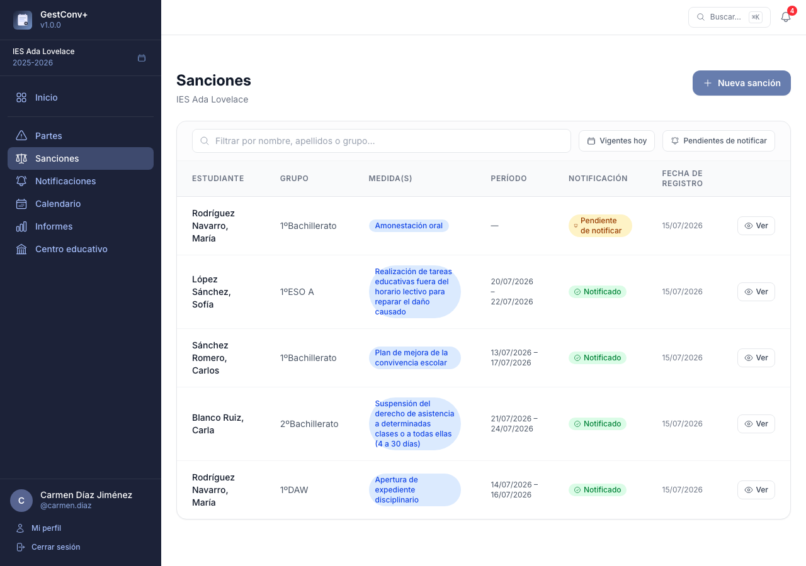
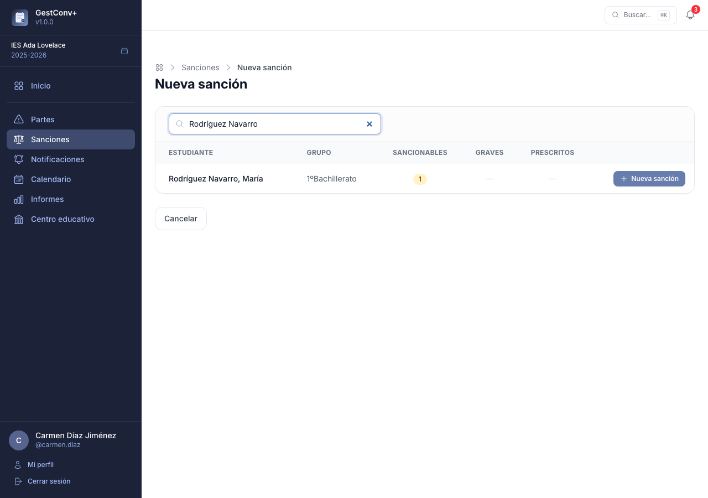
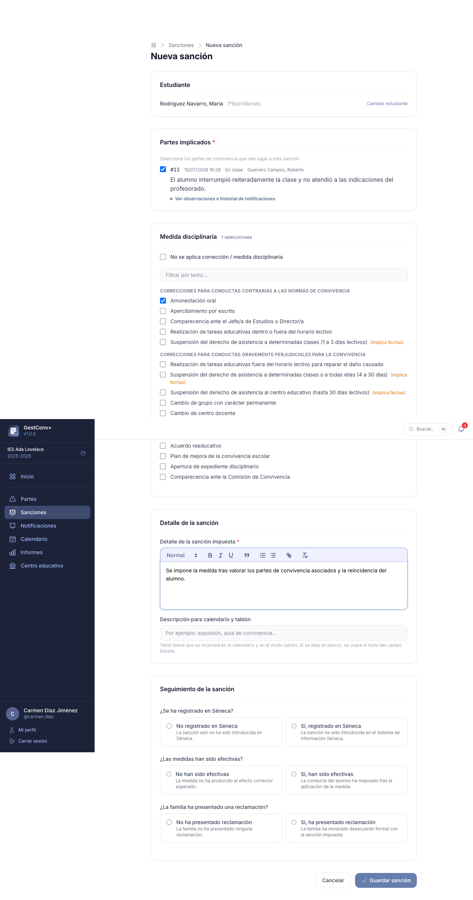

# Sanciones y comisión de convivencia

Este capítulo es para quienes tramitan las sanciones: la **comisión de convivencia** y quienes
administran el centro (normalmente, el equipo directivo). La orientación puede consultar todas
las sanciones, pero no registrarlas; el resto de perfiles solo ve las que le corresponden (ver
[Permisos de un vistazo](08-permisos-de-un-vistazo.md#sanciones)).

La sección **Sanciones** del menú lateral recoge las sanciones del curso activo: qué partes las
motivaron, qué medidas disciplinarias se aplican y en qué fechas están en vigor.

!!! warning "Dos condiciones que conviene tener siempre presentes"
    Una sanción solo puede incorporar partes **ya comunicados a la familia**, y ella misma debe
    comunicarse también: hasta entonces no aparece en el
    [calendario ni en el tablón](05-calendario-y-tablon.md), aunque tenga fechas de vigencia.

## Listado de sanciones

El listado muestra las sanciones accesibles para el docente, con paginación y estas herramientas:

- **Búsqueda por estudiante o grupo**, que filtra en vivo mientras se escribe.
- Filtros de **Vigentes hoy** y **Pendientes de notificar**.
- Una columna con el **estado de la notificación** a la familia, con enlace directo para
  registrar la comunicación si está pendiente.

En pantallas pequeñas, cada fila se muestra como una tarjeta con las etiquetas de campo visibles.

## Registrar una sanción

El registro tiene dos pasos:

1. **Seleccionar al estudiante** — pulsa **Nueva sanción**. El buscador filtra en vivo mientras
   se escribe y la tabla muestra, para cada estudiante, cuántos partes sancionables tiene (ya
   comunicados a la familia y sin sanción), cuántos incluyen conductas graves y cuántos han
   prescrito.

   

2. **Completar el formulario**:

    - **Partes implicados** — la lista de partes sancionables del estudiante (comunicados a la
      familia, sin otra sanción y no prescritos), del más reciente al más antiguo. Marca los que
      motivan la sanción. Cada uno muestra la fecha y hora, el docente que lo registró y la
      descripción completa; un desplegable «Ver observaciones e historial de notificaciones»
      permite consultar el resto sin salir del formulario.
    - **Medidas disciplinarias** — marca las medidas aplicadas, con el mismo filtro de texto y
      contador que las conductas del parte. Si no se aplica ninguna medida, marca la casilla
      correspondiente e indica el motivo.
    - **Detalle de la sanción** — campo de texto con formato para describir la sanción completa.
    - **Descripción para calendario y tablón** — texto breve que se mostrará en el
      [calendario y en el modo tablón](05-calendario-y-tablon.md) en lugar del detalle. Si se
      deja en blanco, se usa el texto del campo Detalle, así que conviene rellenarlo con algo
      corto, directo y descriptivo: «Expulsión», «Aula de convivencia», «Sin recreo»… Todo el
      claustro lo verá de un vistazo en el tablón.
    - **Fechas de inicio y fin** — determinan el periodo de vigencia y cuándo aparece la sanción
      en el calendario.
    - **Seguimiento de la sanción** — tres indicadores que se pueden rellenar al registrarla o
      completar más adelante: si la sanción **se ha registrado en Séneca**, si **las medidas han
      sido efectivas** (la conducta ha mejorado tras aplicarlas) y si **la familia ha presentado
      una reclamación** (en ese caso se indica también su actitud ante la sanción).

## Ver y editar una sanción

Desde el listado, **Ver** abre el detalle de la sanción: los partes incorporados, las medidas,
las fechas de vigencia, el estado del seguimiento y el estado de la notificación a la familia. El
detalle muestra pastillas de estado que resumen la situación de un vistazo: **En Séneca**,
**No efectiva**, **Reclamación** o **Sin corrección** (si no se aplicó ninguna medida).

Igual que en los partes, se pueden añadir **observaciones** a una sanción: anotaciones con fecha,
autor y texto con formato. Quien registra una observación puede editarla o eliminarla durante la
hora siguiente; pasado ese plazo, solo un administrador. Al final de la página aparece el
**historial de comunicaciones** con la familia.

Quien tiene permiso para registrar sanciones (administradores y comisión de convivencia) también
puede editarlas o eliminarlas, estén o no comunicadas a la familia. Mientras la sanción esté
pendiente de comunicar, quien tenga permiso para notificarla ve también un botón **Notificar**
junto a los de editar y eliminar.

## El seguimiento de la convivencia

Dos herramientas ayudan a la comisión a no perder de vista el conjunto:

- **Alumnado con partes pendientes de sanción**, en la pantalla de inicio: los estudiantes con
  más partes ya comunicados a la familia y todavía sin sanción, cada uno con enlace a su
  [ficha](03-el-trabajo-diario.md#ficha-del-estudiante).
- El informe de **estadísticas por grupo**, con los partes registrados, comunicados, sancionados
  y prescritos de cada grupo en un rango de fechas (ver
  [Informes](06-administrar-el-centro.md#informes)).
