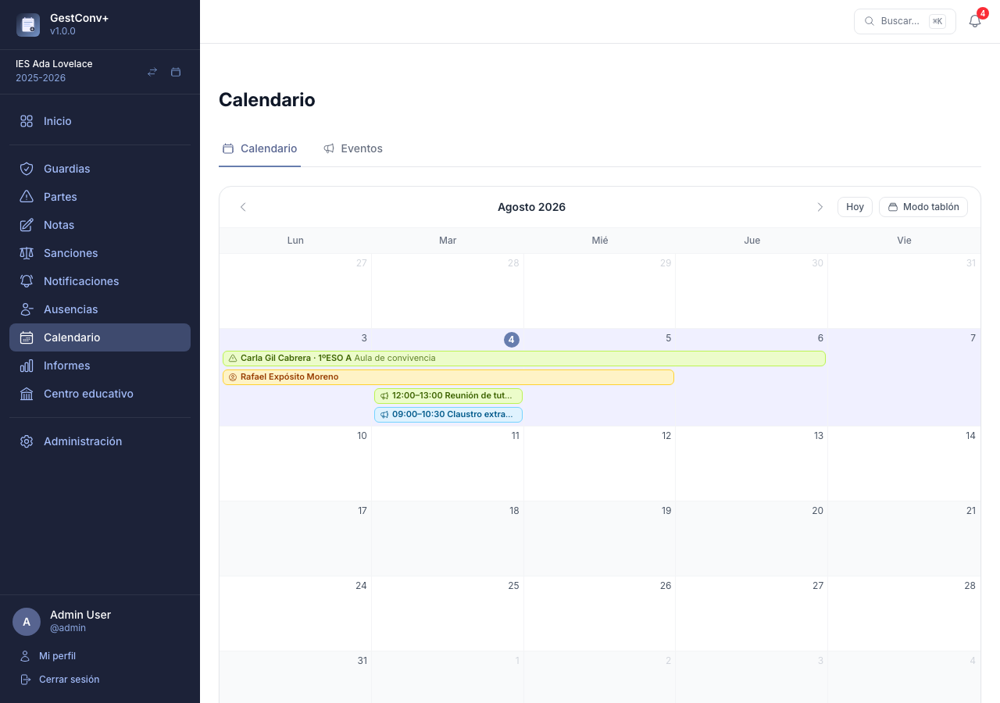
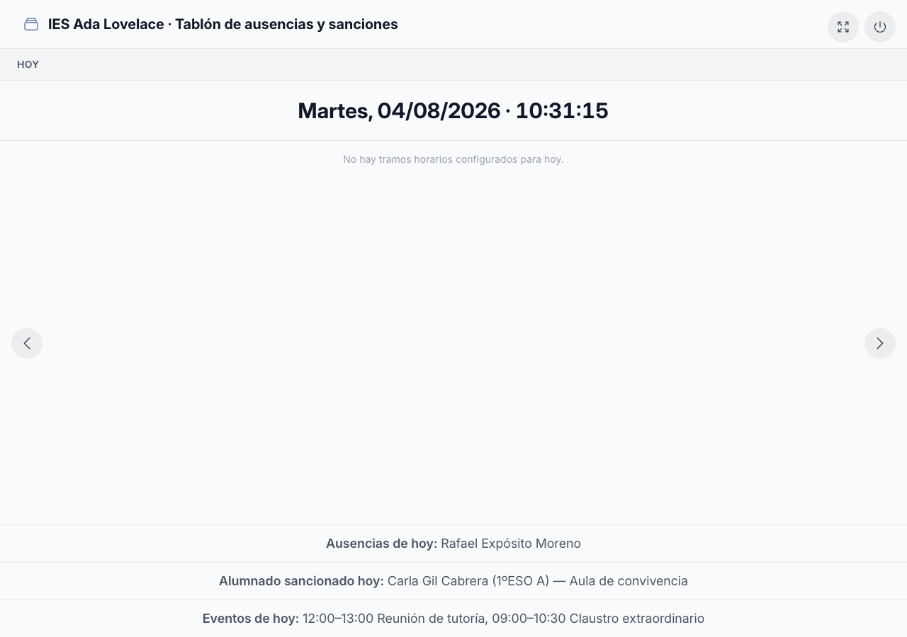

# Calendario y tablón

La sección **Calendario** reúne, en una sola vista mensual, todo lo que le interesa al
profesorado día a día: las **sanciones** en vigor, las **ausencias** del profesorado (solo
administradores) y los **eventos de centro**. Su versión para pantallas del centro, el
**modo tablón**, muestra lo mismo de un vistazo en la sala de profesorado.

## Calendario

La sección **Calendario** del menú lateral muestra, en una vista mensual, todo lo relevante para
quien la consulta:

- **Sanciones**: todas las del curso activo ya comunicadas a la familia y con fecha, sin filtrar
  por autoría ni tutoría — cualquier docente del centro las ve todas. Las pendientes de comunicar
  no aparecen hasta que se registra la comunicación (ver
  [Notificaciones](03-el-trabajo-diario.md#notificaciones)). Cada una se colorea según el grupo del
  estudiante y muestra el icono ⚠, el nombre del estudiante, su grupo y la
  **descripción para calendario y tablón** (o el detalle completo si ese campo está en blanco).
- **Ausencias del profesorado** (solo administradores de centro, ver
  [Ausencias](03-el-trabajo-diario.md#ausencias)): se colorean en ámbar con el icono de un docente
  y muestran únicamente el nombre de quien está ausente, sin grupo ni descripción. El resto del
  profesorado no las ve en su calendario.
- **Eventos de centro** (ver más abajo): se colorean según el grupo si están restringidos a uno, o
  en azul con el icono de un megáfono si son generales, y muestran la hora seguida del nombre del
  evento.
- Solo se muestran los días de lunes a viernes; los fines de semana no aparecen en la cuadrícula.
  Un evento en fin de semana sigue siendo visible en su [vista de detalle](#vista-de-detalle-de-un-dia),
  en el modo tablón y en el panel de inicio, aunque no aparezca en esta cuadrícula mensual.
- El día actual se resalta con un color de fondo distinto en toda su columna.

### Vista de detalle de un día

Al hacer clic en cualquier día de la cuadrícula se abre su ficha completa, con botones para
avanzar o retroceder de día sin volver al calendario:

- Aviso de **día no lectivo**, si aplica (con su descripción, si el día no lectivo la tiene).
- **Tramos horarios y guardias** de ese día de la semana, con el profesorado de guardia y las
  ausencias con actividad encomendada de cada tramo.
- **Sanciones activas** ese día.
- **Ausencias** del profesorado (solo administradores).
- **Eventos** de ese día, con su horario, descripción, enlace si lo tienen, y los grupos a los que
  están restringidos (o la etiqueta **General**).

Los administradores de centro tienen además un botón **Añadir evento** que abre el formulario de
alta con la fecha del día ya rellenada.

## Eventos de centro (solo administradores)

Un **evento de centro** es un aviso puntual con fecha y horario propios — una jornada de puertas
abiertas, un claustro, una reunión de tutoría — que se muestra en el calendario, la vista de día,
el modo tablón y el panel de inicio de quien deba verlo.

Los administradores de centro gestionan los eventos desde la pestaña **Eventos**, junto a
**Calendario**, dentro de la misma sección del menú lateral: un listado paginado con búsqueda por
nombre o descripción y un filtro por grupo, y un botón **Añadir evento** (también disponible desde
la vista de detalle de un día, con la fecha ya rellenada).

Cada evento tiene:

- **Fecha**, **hora de inicio** y **hora de fin** (obligatorias).
- **Nombre** (obligatorio) y **descripción** (opcional).
- **Enlace** opcional (por ejemplo, a un formulario de inscripción o más información).
- **Visibilidad**, elegida con dos opciones:
    - **General** — visible para todo el profesorado del centro.
    - **Restringido a grupos** — visible solo para quien imparte clase o tutoriza alguno de los
      grupos elegidos en un desplegable de búsqueda que admite varios grupos a la vez.

Los administradores ven siempre todos los eventos, tengan o no relación con ellos.

## Modo tablón

El botón **Modo tablón**, junto al botón *Hoy* del calendario, pide confirmación (recuerda que,
una vez dentro, hay que cerrar sesión para salir) y abre una vista a pantalla completa pensada
para dejarse fija en una pantalla del centro — por ejemplo, en la sala de profesorado. Solo pueden
activarlo los administradores; el resto de docentes no ve el botón ni puede acceder a la vista
directamente.

El tablón rota automáticamente entre hasta tres pantallas, en este orden: **Hoy**, **Esta semana**
y **Semana que viene**. Cuando hay más de una pantalla activa aparecen también dos botones, a
izquierda y derecha, para avanzar o retroceder de pantalla sin esperar a la rotación.

### Pantalla "Hoy"

Muestra la fecha del día junto con un reloj que se actualiza cada segundo, y una cuadrícula con
los tramos horarios de la jornada:

- Cada tramo indica el profesorado de guardia y, debajo, las **ausencias con actividad**: el
  docente ausente y, si se pulsa el icono de información, la descripción de la actividad
  encomendada y sus adjuntos, descargables desde el propio tablón.
- El tramo horario que coincide con la hora actual se resalta con un color de fondo distinto, y el
  resaltado se recalcula solo conforme avanza el reloj, sin necesidad de recargar la pantalla.
- Al pie se listan, en una única línea cada una, las **ausencias de hoy** (todo el profesorado
  ausente ese día, tenga o no actividad encomendada), el **alumnado sancionado hoy** (con su grupo
  y la descripción para calendario y tablón, o el detalle recortado si aquella está en blanco) y
  los **eventos de hoy** (con su horario y nombre). Los eventos se muestran incluso en un día no
  lectivo — el resto de la pantalla queda vacía salvo el aviso del día no lectivo, pero un evento
  como una jornada de puertas abiertas puede caer en fiesta y sigue siendo relevante.

### Pantallas de semana

- Muestran una semana (lunes a viernes) en cinco columnas, de modo que todo se lea sin tocar la
  pantalla.
- Para cada día se listan las sanciones que lo cubren, agrupadas por grupo, con el estudiante, la
  descripción para calendario y tablón (o el detalle, si aquella está en blanco) y las fechas de
  inicio y fin. Si el contenido de un día no cabe en la columna, se desplaza automáticamente
  arriba y abajo.

Un botón en la esquina superior alterna la pantalla completa del navegador; otro, con icono de
encendido/apagado, cierra la sesión.

!!! warning "El tablón es una sesión sin salida"
    Una vez activado el modo tablón, esa sesión del navegador no puede navegar a ninguna otra
    parte de la aplicación (salvo para descargar los adjuntos de una actividad desde la propia
    pantalla "Hoy"): cualquier otro intento redirige de vuelta al tablón. La única salida es
    cerrar sesión con el botón de encendido/apagado. Así, la pantalla del centro puede quedarse
    encendida sin riesgo de que alguien la use para consultar otros datos.

## Ajustes del modo tablón

Los administradores pueden afinar el comportamiento del tablón desde **Ajustes** (ver
[Sistema de ajustes](07-administrar-la-plataforma.md#sistema-de-ajustes)):

| Ajuste | Rango | Por defecto |
|---|---|---|
| Duración de la pantalla "Hoy" | 0-3600 segundos | 60 |
| Duración de la semana actual | 0-3600 segundos | 10 |
| Duración de la semana siguiente | 0-3600 segundos | 0 |
| Tema del modo tablón | Claro / Oscuro / Según el sistema | Claro |

Las tres duraciones controlan cuántos segundos se muestra cada pantalla antes de pasar a la
siguiente. Un valor de 0 en cualquiera de ellas omite esa pantalla de la rotación.

El tema controla la combinación de colores: claro, oscuro, o **según el sistema**, que sigue en
todo momento la preferencia de color del dispositivo que muestra el tablón, incluidos los cambios
que se produzcan con la pantalla ya abierta, sin recargarla.

Los cuatro ajustes se fijan a nivel global o de centro; no existen como preferencia individual de
docente.
