# Secciones de la aplicación

Este capítulo recorre las secciones de la aplicación en el mismo orden en que se usan durante el curso: del panel de inicio al registro de partes, las sanciones, la notificación a las familias y su seguimiento en el calendario. La configuración del centro y la administración global cierran el capítulo.

## Inicio

El panel de inicio muestra un resumen del curso activo, adaptado al rol del docente autenticado.

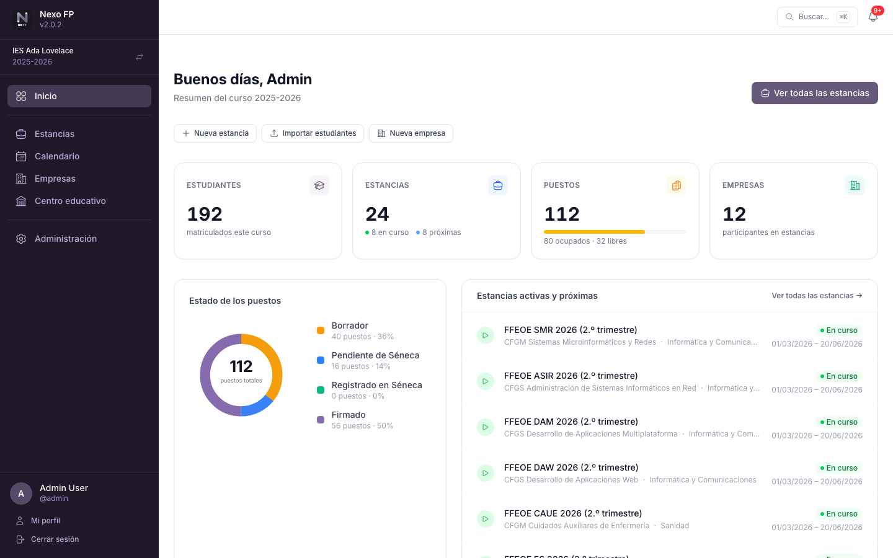

En la parte superior hay cuatro tarjetas:

- **Estudiantes** — matriculados en el curso activo (solo los visibles según el rol del docente).
- **Partes de convivencia** — registrados en los últimos 30 días y accesibles para ese docente.
- **Sanciones vigentes** — sanciones en vigor en el día de hoy.
- **Pendientes de notificar** — partes y sanciones aún sin comunicar a la familia. Esta tarjeta se muestra siempre: en rojo cuando hay elementos pendientes y en verde cuando no queda nada por comunicar.

Debajo de las tarjetas:

- **Accesos rápidos** — **Nuevo parte** (visible para todo el profesorado) e **Importar estudiantes** (solo para quienes administran el centro).
- **Últimos partes** — los seis partes más recientes accesibles para el docente, cada uno con su estado (*Notificado* / *Pendiente de notificar*).
- **Alumnado con partes pendientes de sanción** — visible para administradores, comisión de convivencia y orientación: los estudiantes con más partes ya notificados y todavía sin sanción. Cada nombre enlaza con su [ficha del alumno](#ficha-del-alumno).
- **Tus grupos** — visible para los tutores/as sin los perfiles anteriores: sus grupos tutorizados y el número de estudiantes de cada uno.

### Cambio de curso académico (administradores)

Los administradores de centro y los administradores globales pueden consultar cursos académicos anteriores sin modificar el curso activo. El selector de curso aparece en la cabecera del menú lateral. Al visualizar un curso histórico, la aplicación muestra un aviso en ámbar y bloquea las operaciones de escritura.

## Búsqueda global y paleta de comandos

El campo **Buscar…** de la cabecera abre una paleta de búsqueda que también puede invocarse con el atajo de teclado **Ctrl+K** (**⌘K** en Mac) desde cualquier pantalla. Los resultados se agrupan por tipo y se filtran mientras se escribe, sin distinguir mayúsculas ni tildes:

- **Estudiantes** — abre la [ficha del alumno](#ficha-del-alumno) correspondiente.
- **Docentes** — solo para administradores.
- **Acciones** — accesos directos a **Nuevo parte**, **Ir a notificaciones** y **Cambiar de curso** (esta última requiere permisos de administración). Las acciones aparecen nada más abrir la paleta y se filtran igual que el resto de resultados.

## Partes de convivencia

La sección **Partes** está accesible desde el menú lateral para cualquier docente con un centro seleccionado. Permite registrar y consultar los partes de convivencia del curso activo.

### Quién puede ver cada parte

| Perfil | Qué puede ver |
|---|---|
| Docente (sin rol especial) | Solo los partes que él mismo ha registrado |
| Tutor/a de grupo | Sus propios partes y todos los del grupo que tutoriza |
| Comisión de convivencia | Todos los partes del centro |
| Orientador/a | Todos los partes del centro |
| Administrador de centro | Todos los partes del centro |
| Administrador global | Todos los partes de todos los centros |

### Registrar un nuevo parte

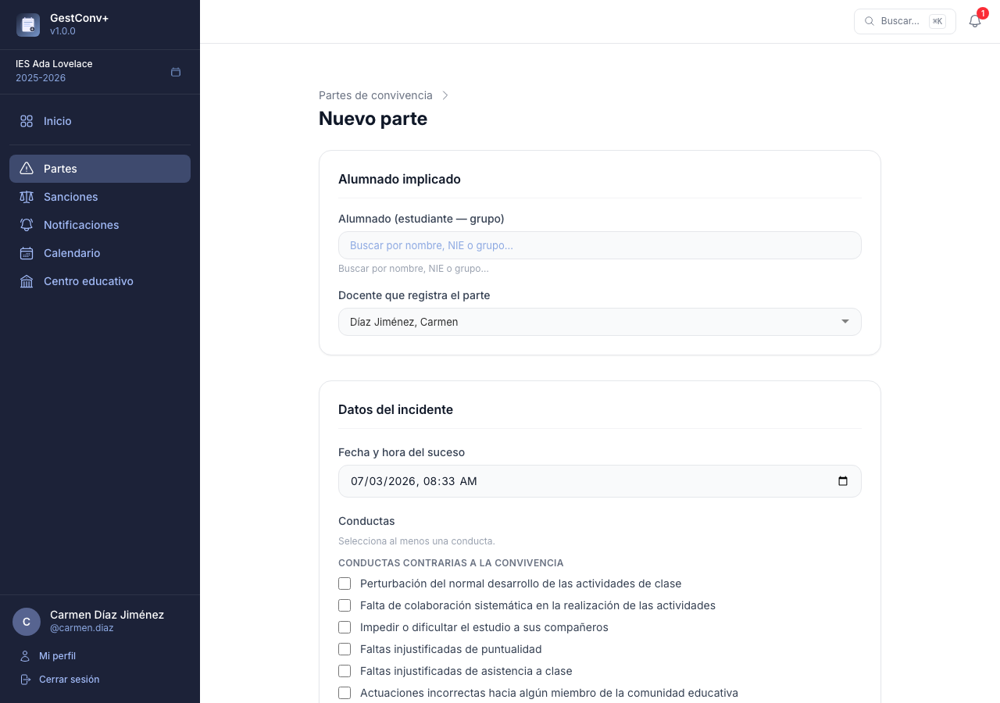

1. Pulsa **Nuevo parte** en la esquina superior derecha de la sección o desde el acceso rápido del inicio.
2. **Alumnado implicado** — escribe en el campo de búsqueda el nombre o NIE del estudiante. El desplegable muestra el nombre del alumno con el grupo como información secundaria. Si en el incidente participaron varios estudiantes (incluso de grupos distintos), selecciónalos todos: se creará un parte independiente para cada uno con los mismos datos.

   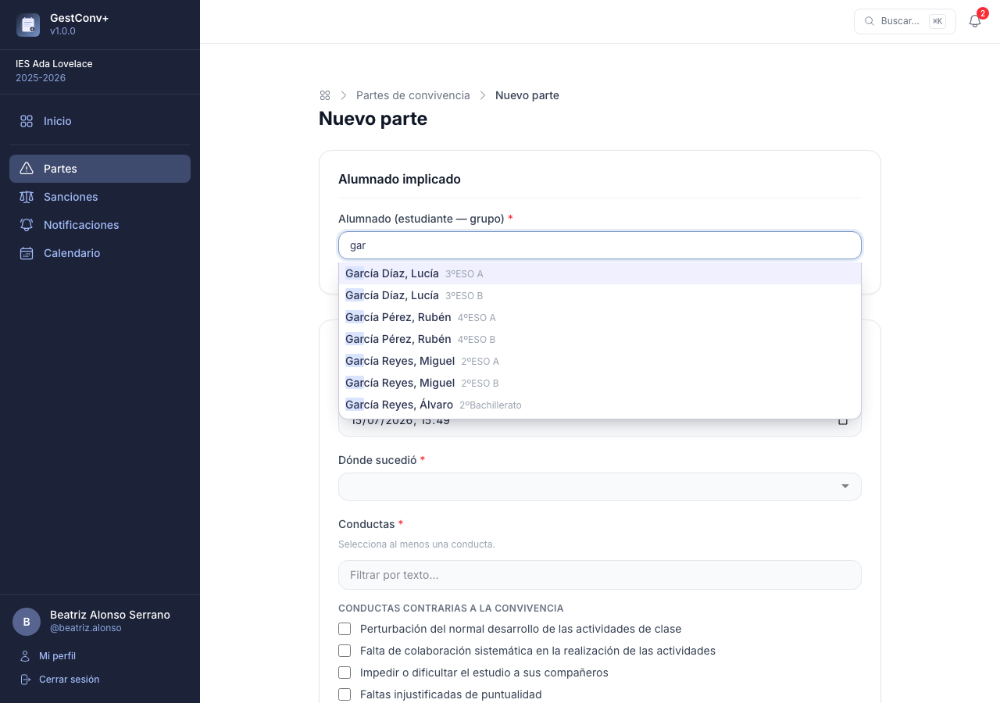

3. **Fecha y hora del suceso** — por defecto se rellena con el momento actual; modifícala si el parte se registra con posterioridad al incidente.
4. **Conductas** — marca al menos una conducta de las definidas para el centro. Las conductas están agrupadas en *Contrarias a la convivencia* y *Conductas graves*; los bloques de conductas graves se destacan con un recuadro rojo. Un campo de filtro sobre la lista oculta al instante las conductas que no coinciden con el texto escrito (sin distinguir mayúsculas ni tildes) y, junto al título de la sección, un contador indica cuántas conductas hay seleccionadas. Solo aparecen las conductas activas.
5. **Descripción de lo acontecido** — campo de texto enriquecido obligatorio. Describe los hechos con detalle.
6. **Expulsión del aula** — activa el interruptor si el alumno fue expulsado. Aparecerán entonces dos campos adicionales:
   - *Tareas encargadas durante la expulsión*
   - *¿Realizó las tareas?* (opciones: No se sabe / Sí / No)
7. Pulsa **Guardar parte**. Una pantalla de confirmación muestra los partes creados (uno por alumno) con accesos directos para **notificar a la familia**, **crear otro parte** o **volver al listado**.

Los campos obligatorios están marcados con un asterisco; si falta alguno al guardar, cada error se muestra junto al campo afectado.

> Cada parte queda vinculado al docente que lo registra. La fecha y hora de creación se registran automáticamente.

### Listado y filtros

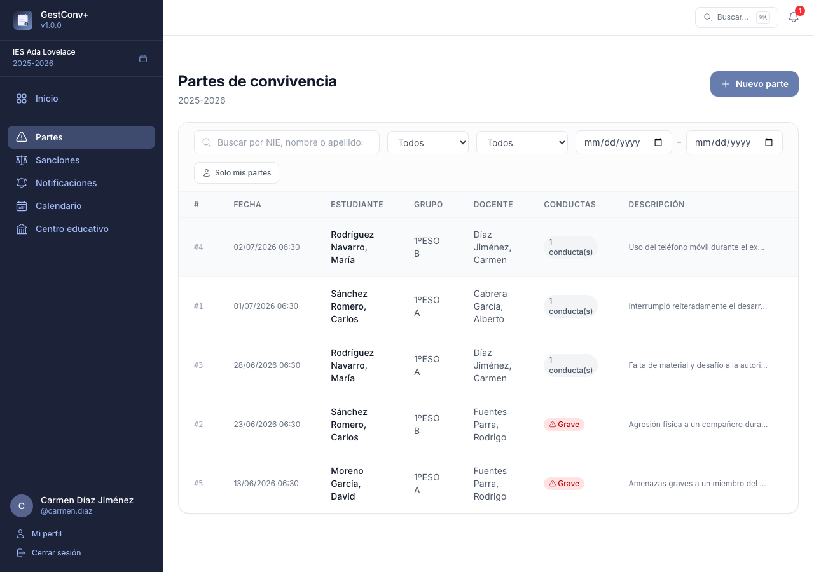

El listado muestra los partes accesibles según el perfil del docente, ordenados del más reciente al más antiguo, con paginación. La primera columna (`#`) indica el número de parte dentro del curso académico activo. Los filtros disponibles son:

| Filtro | Descripción |
|---|---|
| Búsqueda libre | Busca por nombre del estudiante, nombre del docente, conducta o contenido de la descripción |
| Solo mis partes | Alterna entre ver solo los propios o todos los accesibles |
| Gravedad | Muestra solo partes con conductas graves, solo contrarias, o todos |
| Expulsión | Muestra solo partes con expulsión del aula |
| Rango de fechas | Filtra por fecha del suceso (desde / hasta) |

En pantallas pequeñas, cada fila del listado se muestra como una tarjeta con las etiquetas de campo visibles.

### Ver y editar un parte

Pulsa **Ver** en cualquier fila del listado para abrir el detalle completo del parte. Al final de la página aparece el **historial de comunicaciones** con la familia: cada intento registrado, con su fecha, método, docente, resultado y observaciones.

Desde el detalle puedes **editar** el parte si eres el docente que lo registró o un administrador. El número de parte (`#1`, `#2`…) aparece junto al título y es de solo lectura: identifica el parte dentro del curso académico y no cambia al editar.

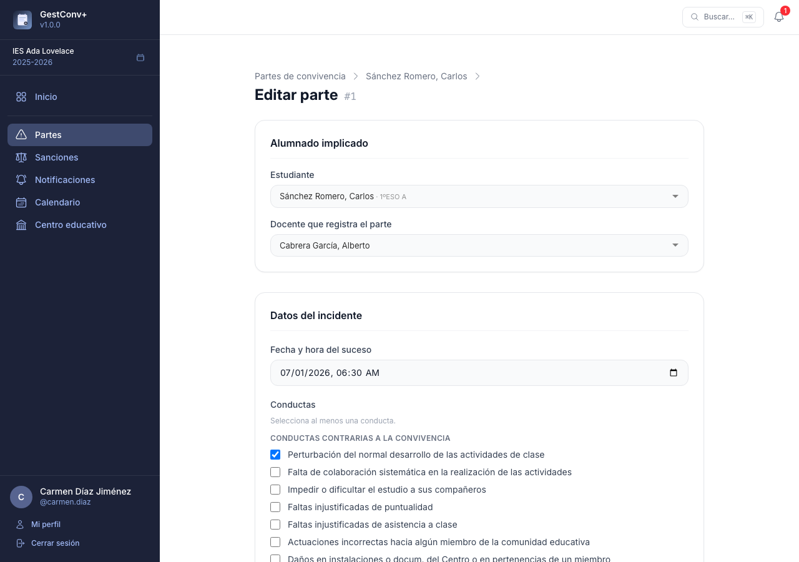

Los campos editables son los mismos que en la creación. Los administradores pueden además **reasignar el docente y el estudiante** de un parte ya registrado; el resto de docentes no puede cambiar ni el alumnado implicado ni el grupo.

Un administrador puede **eliminar** el parte definitivamente desde el detalle. Esta acción es irreversible.

### Conductas contrarias a la convivencia

Los administradores de centro configuran las conductas disponibles en **Centro educativo › Conductas contrarias**.

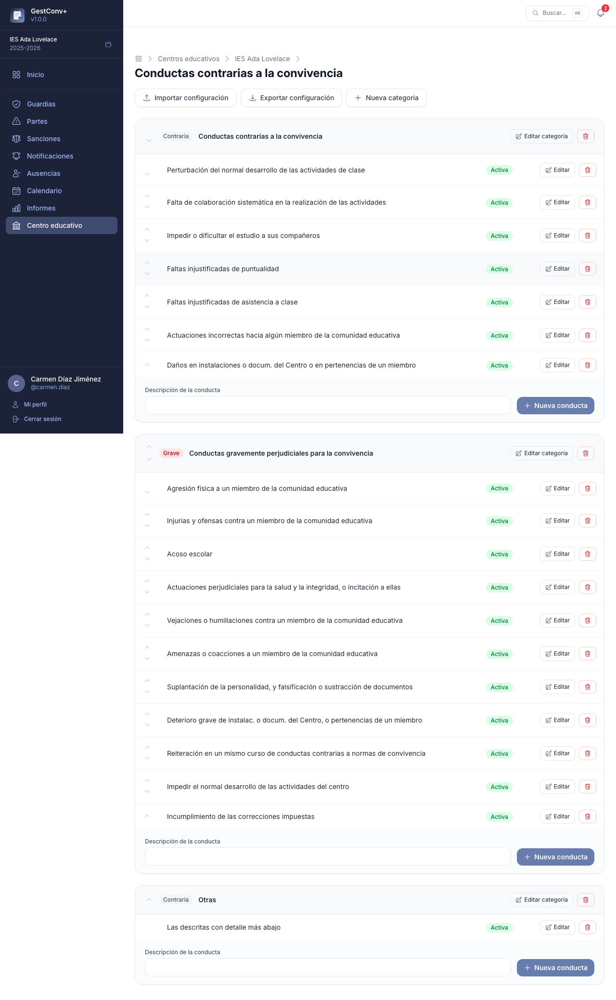

Para cada conducta pueden:

- Activarla o desactivarla (solo las activas se pueden seleccionar al registrar un parte).
- Marcarla como *grave* o *contraria*.
- Cambiar su orden mediante las flechas.
- Editar la descripción o eliminarla.

Al crear un centro nuevo se configuran automáticamente **19 conductas por defecto** basadas en la normativa de convivencia escolar de Andalucía, ordenadas de contrarias a graves.

Los botones **Exportar JSON** e **Importar JSON** permiten copiar la configuración de conductas y categorías entre centros: la exportación descarga un fichero con las categorías y sus conductas, y la importación lo vuelve a cargar, creando lo que no exista y actualizando el resto por nombre (sin distinguir mayúsculas). La importación ofrece además la opción de **vaciar las conductas y categorías existentes** antes de incorporar las del fichero; esta acción elimina también las categorías actuales y no se puede deshacer.

## Sanciones

La sección **Sanciones** del menú lateral recoge las sanciones del curso activo: qué partes las motivaron, qué medidas disciplinarias se aplican y en qué fechas están en vigor. Quién puede verlas, registrarlas o editarlas depende del perfil del docente; consulta la tabla de [Roles y permisos](03-roles-y-permisos.md#sanciones).

> Una sanción solo puede incorporar partes que ya han sido **notificados a la familia**, y ella misma debe notificarse para aparecer en el [calendario](#calendario) y en el modo tablón.

### Listado de sanciones

El listado muestra las sanciones accesibles para el docente, con paginación y estas herramientas:

- **Búsqueda por alumno o grupo**, que filtra en vivo mientras se escribe.
- Filtros de **Vigentes hoy** y **Pendientes de notificar**.
- Una columna con el **estado de la notificación** a la familia, con enlace directo para registrar la comunicación si está pendiente.

En pantallas pequeñas, cada fila se muestra como una tarjeta con las etiquetas de campo visibles.

### Registrar una sanción

El registro tiene dos pasos:

1. **Seleccionar al estudiante** — pulsa **Nueva sanción**. El buscador filtra en vivo mientras se escribe y la tabla muestra, para cada estudiante, cuántos partes sancionables tiene (ya notificados y sin sanción), cuántos incluyen conductas graves y cuántos han prescrito.
2. **Completar el formulario**:
   - **Partes a incorporar** — la lista de partes sancionables del estudiante en ese grupo (notificados a la familia, sin otra sanción y no prescritos), del más reciente al más antiguo. Marca los que motivan la sanción.
   - **Medidas disciplinarias** — marca las medidas aplicadas, con el mismo filtro de texto y contador de seleccionadas que las conductas del parte. Si no se aplica ninguna medida, marca la casilla correspondiente e indica el motivo.
   - **Detalle** — campo de texto enriquecido para describir la sanción.
   - **Fechas de inicio y fin** — determinan el periodo de vigencia y cuándo aparece la sanción en el calendario.

### Ver y editar una sanción

Desde el listado, **Ver** abre el detalle de la sanción: los partes incorporados, las medidas, las fechas de vigencia y el estado de la notificación a la familia. Al final de la página aparece el **historial de comunicaciones** con la familia. Quien tiene permiso para registrarla también puede editarla o eliminarla.

### Medidas disciplinarias

Los administradores de centro configuran las medidas disponibles en **Centro educativo › Sanciones › Medidas disciplinarias**, organizadas en categorías igual que las conductas contrarias.

Al igual que en las conductas, los botones **Exportar JSON** e **Importar JSON** permiten copiar la configuración de medidas y categorías entre centros, con la misma opción de vaciar las medidas y categorías existentes antes de importar.

## Ficha del alumno

La ficha del alumno reúne en una sola pantalla toda la información de convivencia de un estudiante:

- **Datos básicos** — nombre y grupo.
- **Contadores** — partes registrados (indicando cuántos incluyen conductas graves y cuántos han prescrito) y sanciones vigentes hoy.
- **Datos de contacto** — tutores legales, teléfonos y observaciones. Solo son visibles para los administradores, la comisión de convivencia, la orientación y los tutores/as del grupo del alumno.
- **Historial de convivencia** — los partes y sanciones del estudiante en orden cronológico, cada uno con su estado de notificación. Se muestran solo los visibles según los permisos del docente.
- **Accesos directos** para registrar un nuevo parte o una nueva sanción con el alumno ya seleccionado.

Se llega a la ficha desde el buscador global, el listado y el detalle de partes, el detalle de sanciones y la lista *Alumnado con partes pendientes de sanción* del inicio.

## Notificaciones

La sección **Notificaciones**, accesible desde el menú lateral con un centro seleccionado, es la cola de partes y sanciones cuya familia todavía no ha sido informada.

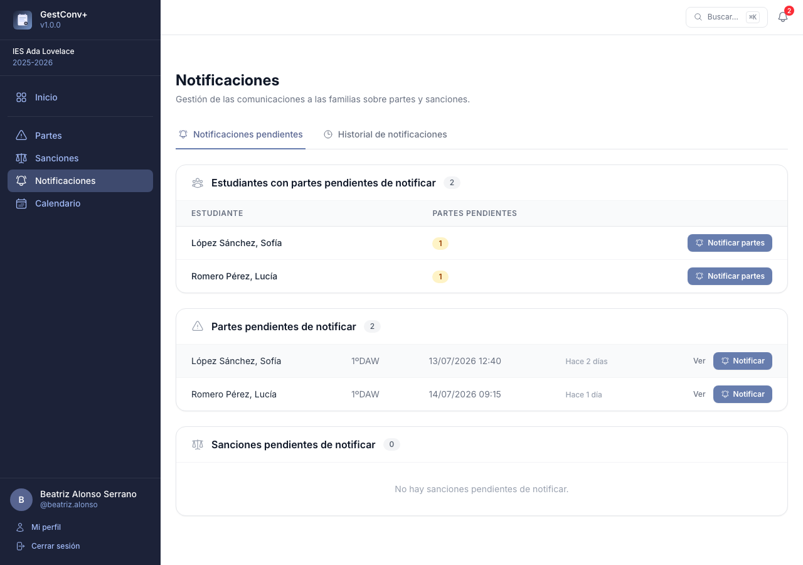

Mientras un parte no tenga registrada una comunicación exitosa con la familia, **no puede incorporarse a una sanción**. De la misma forma, una sanción sin comunicación exitosa **no aparece en el calendario ni en el modo tablón**, aunque tenga fechas de vigencia asignadas: a efectos de visualización, no entra en vigor hasta que se notifica.

Cada elemento de la cola muestra su **antigüedad** (los días transcurridos desde que se registró), destacada en ámbar a partir de tres días y en rojo a partir de siete, para localizar de un vistazo los más atrasados.

El botón **Notificar** solo aparece si el docente tiene permiso para registrar la comunicación de ese elemento (ver *Quién puede notificar* más abajo); en caso contrario, el parte o sanción aparece igualmente en la lista, sin acción disponible. Los administradores siempre pueden notificar cualquier elemento.

### Registrar una comunicación

Pulsa **Notificar** en la fila correspondiente para abrir el formulario de registro, común a partes y sanciones.

Si el docente tiene permiso para verlos, la pantalla muestra también los **datos de contacto** del alumno (tutores legales, teléfonos y observaciones) justo antes del formulario: los mismos que en la [ficha del alumno](#ficha-del-alumno) (equipo directivo, comisión de convivencia, orientación y tutores/as del grupo) y, además, siempre el propio docente que registró el parte o la sanción, para que pueda contactar con la familia aunque no sea tutor del grupo.

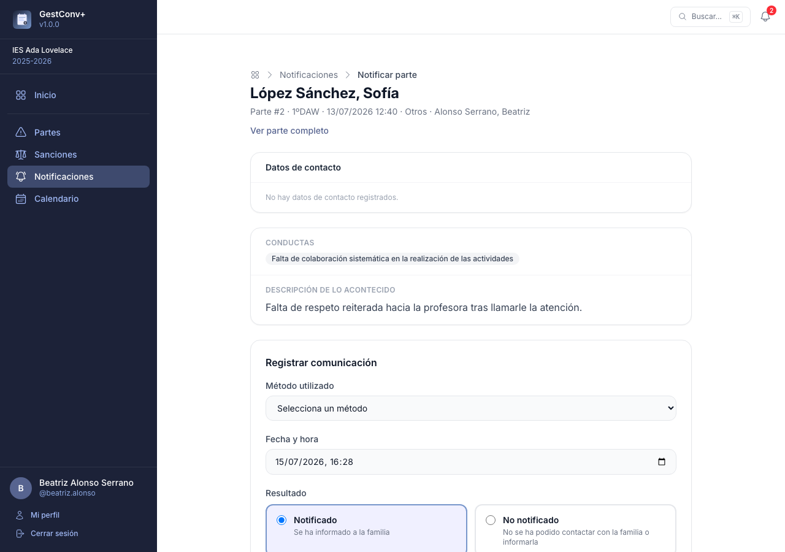

1. **Método utilizado** — uno de los métodos de comunicación activos del centro (ver más abajo).
2. **Fecha y hora** — por defecto el momento actual.
3. **Resultado** — *Notificado* (la familia ha sido informada correctamente) o *No notificado* (no se ha podido contactar o informar).
4. **Observaciones** — campo de texto opcional.

Al guardar se vuelve a la cola de notificaciones, lista para continuar con el siguiente elemento pendiente.

Cada intento de comunicación queda registrado en el **historial**, se marque o no como notificado. La primera comunicación con resultado *Notificado* es la que desbloquea el parte o la sanción; los intentos posteriores se siguen añadiendo al historial pero no cambian ese estado.

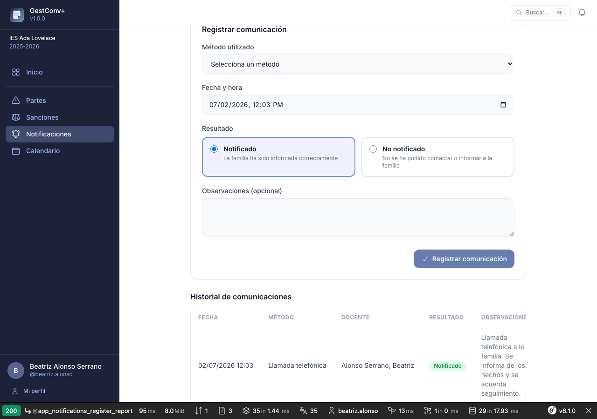

El detalle de un parte o de una sanción muestra un indicador de estado (**Notificado** / **Pendiente de notificar**) enlazado a esta pantalla de registro.

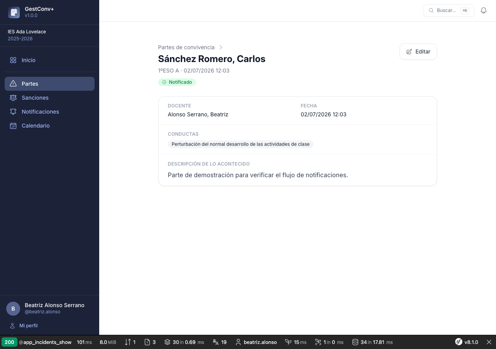

### Quién puede notificar

Un ajuste por centro (**Centro educativo › Ajustes**) determina, además de los administradores, qué docentes pueden registrar la comunicación de un parte y de una sanción, de forma independiente:

- **El docente del parte / de la sanción** — solo quien lo registró.
- **El tutor/a de grupo** — solo los tutores del grupo del alumno.
- **Ambos** (opción por defecto).

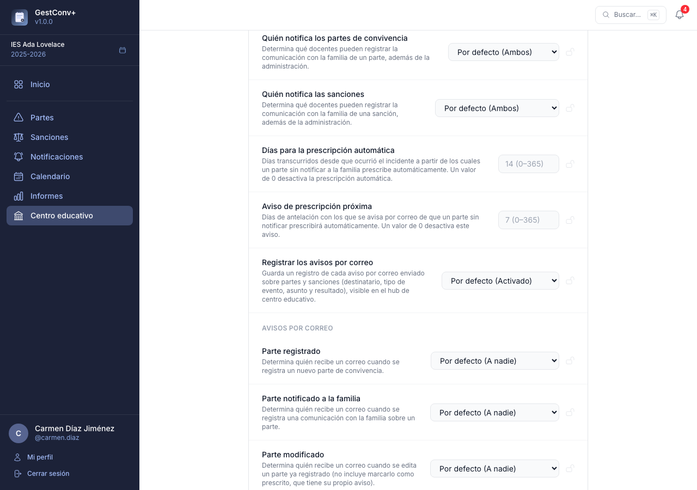

### Métodos de comunicación

Los administradores de centro configuran los métodos disponibles en **Centro educativo › Métodos de comunicación**: una lista plana (sin categorías) que se activa o desactiva por elemento y se puede reordenar con las flechas. Solo los métodos activos son seleccionables al registrar una comunicación.

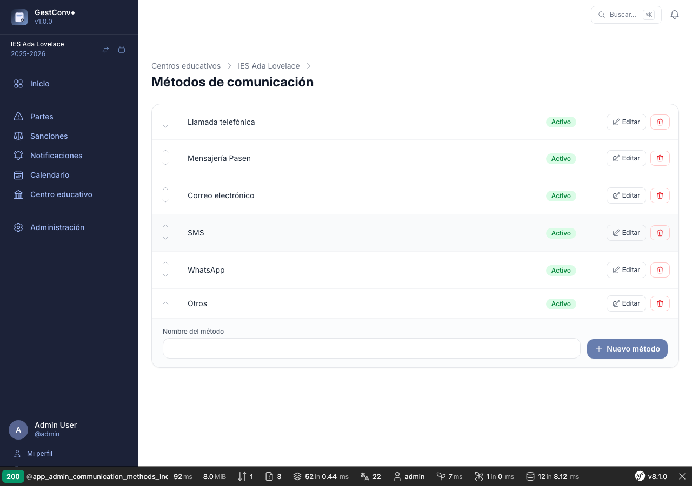

Al crear un centro nuevo se configuran automáticamente **6 métodos por defecto**: Llamada telefónica, Mensajería Pasen, Correo electrónico, SMS, WhatsApp y Otros. Un método que ya se ha usado en alguna comunicación no se puede eliminar (aparece un aviso); en ese caso, desactívalo en su lugar.

## Calendario

La sección **Calendario**, accesible desde el menú lateral, muestra en una vista mensual las sanciones del curso académico activo que tienen fecha asignada (campo *Fecha de inicio*, y opcionalmente *Fecha de fin*, del parte de sanción).

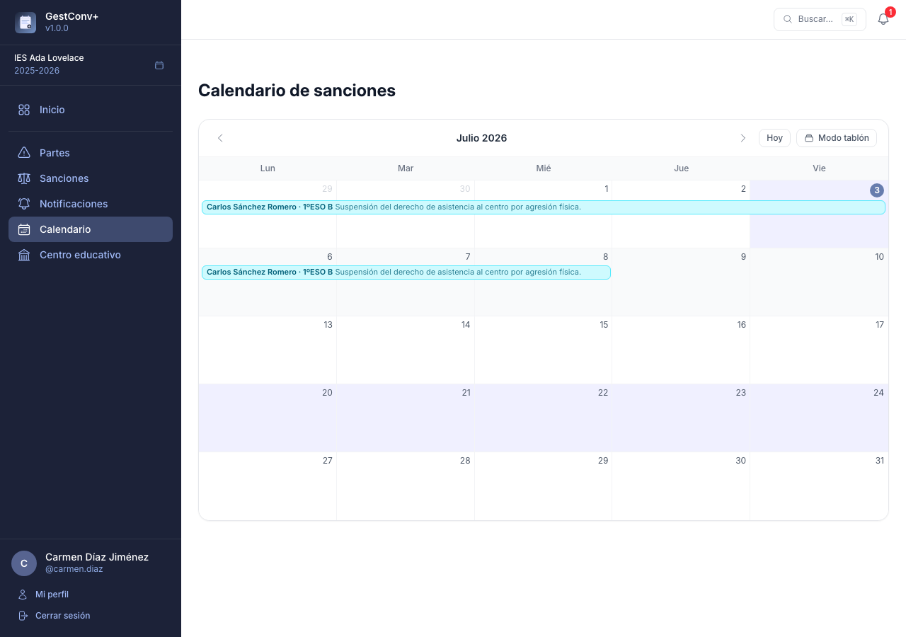

- Se muestran **todas las sanciones del curso ya notificadas a la familia y con fecha**, sin filtrar por autoría ni tutoría: cualquier docente con un centro seleccionado las ve todas. Las sanciones pendientes de notificar no aparecen hasta que se registra la comunicación (ver [Notificaciones](#notificaciones)).
- Cada sanción aparece como una barra horizontal que puede abarcar varios días si tiene fecha de fin. Dentro de la barra se muestra el nombre del alumno, su grupo (el grupo con el que se registró la sanción) y el detalle de la sanción.
- El color de la barra depende del grupo: todas las sanciones de alumnos del mismo grupo comparten color, lo que permite distinguir de un vistazo a qué grupos pertenecen las sanciones visibles en una misma semana.
- Solo se muestran los días lectivos de lunes a viernes; sábados y domingos no aparecen en la cuadrícula.
- El día actual se resalta con un color de fondo distinto en toda su columna.

### Modo tablón

El botón **Modo tablón**, junto al botón *Hoy* del calendario, abre una vista a pantalla completa pensada para mostrarse en una pantalla o monitor del centro (por ejemplo, en la sala de profesorado). Solo pueden activarlo los administradores de centro y los administradores globales; el resto de docentes no ven el botón ni pueden acceder a la URL directamente.

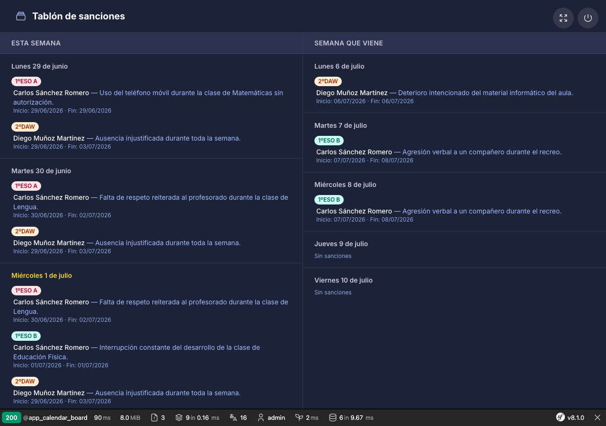

- Muestra una semana (lunes a viernes) a la vez, en cinco columnas, para que todo el contenido se lea de un vistazo sin necesidad de desplazar la pantalla a mano.
- Para cada día se listan las sanciones que lo cubren, agrupadas por grupo, indicando el alumno, el detalle de la sanción y sus fechas de inicio y fin. Si el contenido de un día no cabe en la columna, se desplaza automáticamente hacia arriba y hacia abajo; no se puede desplazar manualmente.
- La semana actual y la semana siguiente se alternan automáticamente con una transición suave. Los administradores de centro y globales pueden configurar en **Ajustes** cuántos segundos se muestra cada una (0-3600 segundos; 15 y 5 por defecto). Si cualquiera de los dos ajustes vale 0, solo se muestra la semana actual, sin alternancia.
- Un botón en la esquina superior permite alternar la pantalla completa del navegador.
- Un botón con icono de encendido/apagado, en la misma esquina, cierra la sesión.

> Una vez activado el modo tablón, no se puede navegar a ninguna otra parte de la aplicación en esa sesión del navegador: cualquier intento de acceder a otra pantalla redirige de vuelta al tablón. La única salida es cerrar sesión con el botón de encendido/apagado.

## Centro Educativo

La sección **Centro educativo** del menú lateral es el panel de configuración del centro, reservado a los administradores. Desde sus tarjetas se gestionan los docentes, la oferta formativa, los estudiantes, las conductas contrarias, las medidas disciplinarias, los métodos de comunicación, los perfiles especiales y los ajustes del centro. Las conductas, medidas y métodos se describen en las secciones anteriores de este capítulo; a continuación se detallan el resto de apartados.

### Estructurar la oferta formativa

La tarjeta **Oferta formativa** del panel de centro educativo abre un editor de tres columnas
(enseñanzas → niveles → grupos, también llamado «columnas de Miller») para el curso académico
activo del centro. Seleccionar un elemento de una columna muestra sus elementos dependientes en la
columna siguiente; las altas, ediciones y bajas se aplican al instante, sin recargar la página.

- **Enseñanzas** — se crean indicando su familia profesional y su nombre. Desde el panel de detalle
  se les puede asignar un coordinador.
- **Niveles** — cursos dentro de una enseñanza (por ejemplo, 1º y 2º de un ciclo). Admiten uno o
  varios coordinadores.
- **Grupos** — unidades dentro de un nivel (por ejemplo, 1ºA, 1ºB). Admiten uno o varios tutores y
  el resto del profesorado que imparte clase en ellos.

Si el centro no tiene un curso académico activo, la sección muestra un aviso y no permite gestionar
la oferta formativa. Ver también el paso a paso completo en
[Primeros pasos](02-primeros-pasos.md#3-estructurar-la-oferta-formativa-del-curso-academico-equipo-directivo).

### Exportar e importar la oferta formativa

Los botones **Exportar JSON** e **Importar JSON**, disponibles junto al editor, permiten copiar la
oferta formativa completa (enseñanzas, niveles y grupos) de un curso o centro a otro sin
reconstruirla a mano. El fichero JSON es un formato propio de GestConv+, no algo que se descargue de
Séneca.

Al importar puede marcarse la opción de incluir también las asignaciones de **tutores** y
**docentes de grupo**; si algún docente mencionado en el fichero no existe en el centro de destino,
se omite su asignación y se informa de los nombres no encontrados al finalizar la importación. Los
botones de exportar/importar no están disponibles al consultar un curso académico histórico.

### Perfiles

La tarjeta **Perfiles** del panel de centro educativo permite a los administradores de centro y globales asignar dos roles especiales a docentes concretos del centro:

- **Comisión de convivencia** — acceden a todos los partes del centro y pueden registrar sanciones para cualquier estudiante, con los mismos permisos que un administrador de centro sobre partes y sanciones.
- **Orientador/a** — acceden a todos los partes y sanciones del centro, pero no pueden crear, editar ni eliminar los que no han registrado ellos mismos.

Ambos perfiles se asignan mediante buscadores de docentes con autocompletado, restringidos al curso académico activo del centro. Si el centro no tiene un curso activo, la página muestra un aviso y no permite gestionar los perfiles.

Ninguno de los dos perfiles concede acceso al resto del panel de centro educativo (oferta formativa, estudiantes, conductas, etc.): solo amplían la visibilidad y los permisos sobre partes de convivencia y sanciones.

## Administración

### Registro de actividad

El registro de actividad recoge las acciones relevantes realizadas en la plataforma: accesos, modificaciones de datos, importaciones y exportaciones. Solo es visible para los administradores globales.

#### Qué se registra

- Inicio y cierre de sesión, intentos fallidos de autenticación.
- Operaciones de escritura sobre cualquier sección (POST, PUT, PATCH, DELETE).
- Exportaciones e importaciones de datos.

#### Filtros disponibles

El listado de actividad admite filtrado por usuario, centro educativo, curso académico, tipo de acción y rango de fechas. También permite ordenar por fecha de forma ascendente o descendente.

#### Retención y privacidad

Los registros de actividad se purgan automáticamente cada semana mediante una tarea programada
(no existe un comando de consola para lanzar la purga manualmente): se eliminan los registros
anteriores al número de días configurado en la variable de entorno `APP_LOG_RETENTION_DAYS` (90
días por defecto). Consulta el capítulo [Operación y mantenimiento](10-operacion-y-mantenimiento.md)
para más detalles sobre esta tarea programada.
