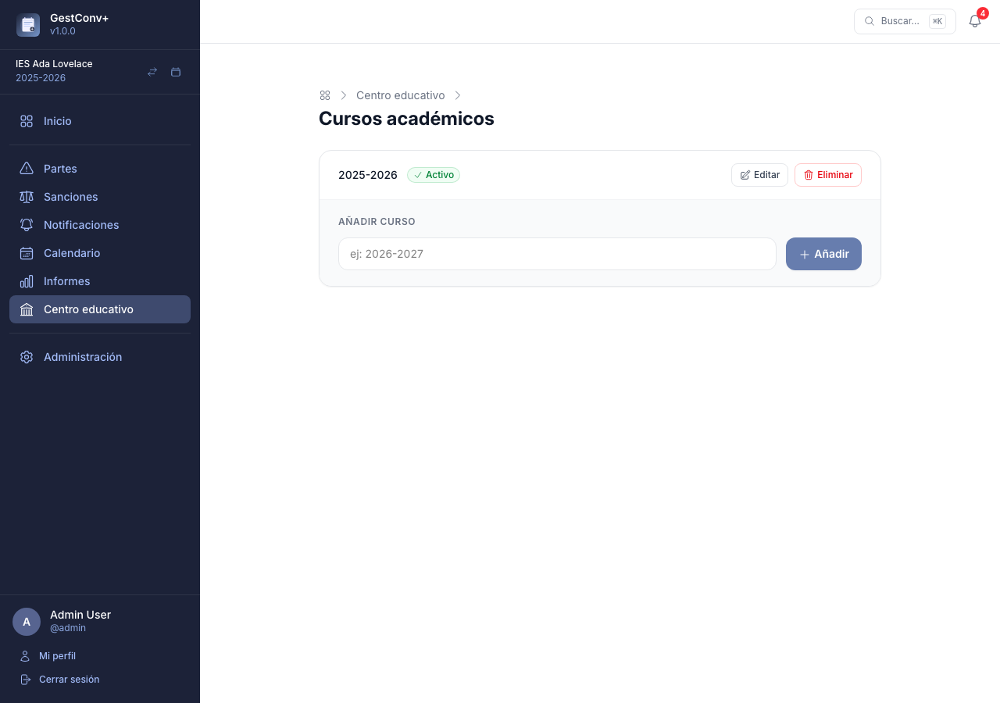
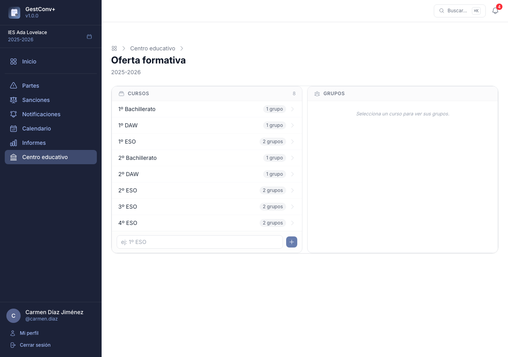
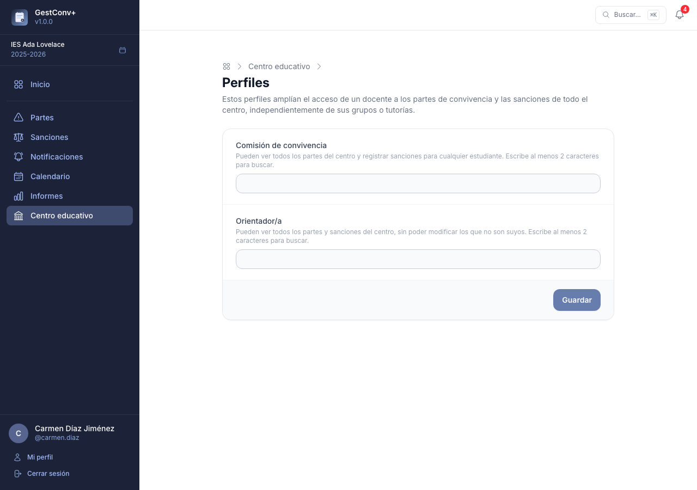
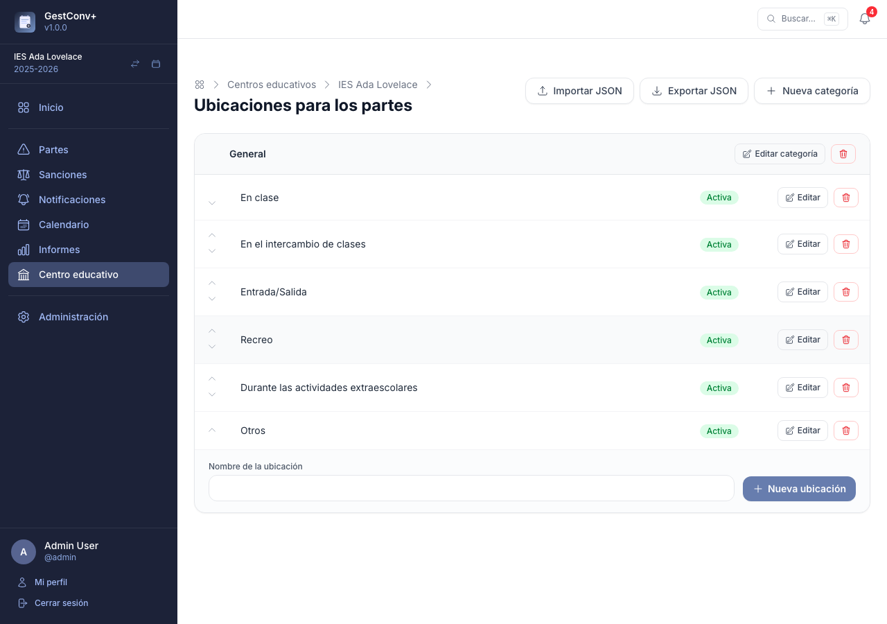
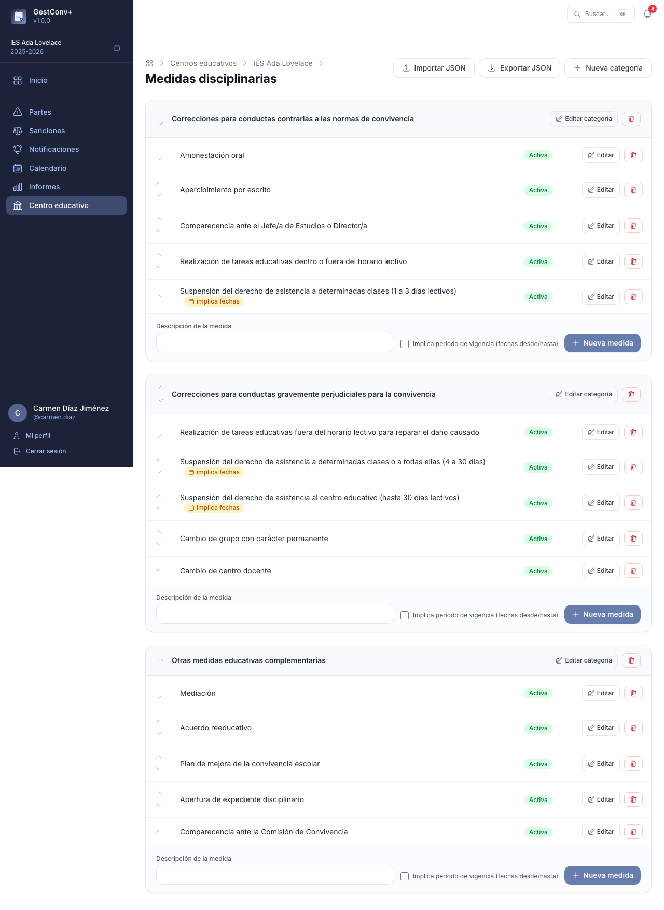
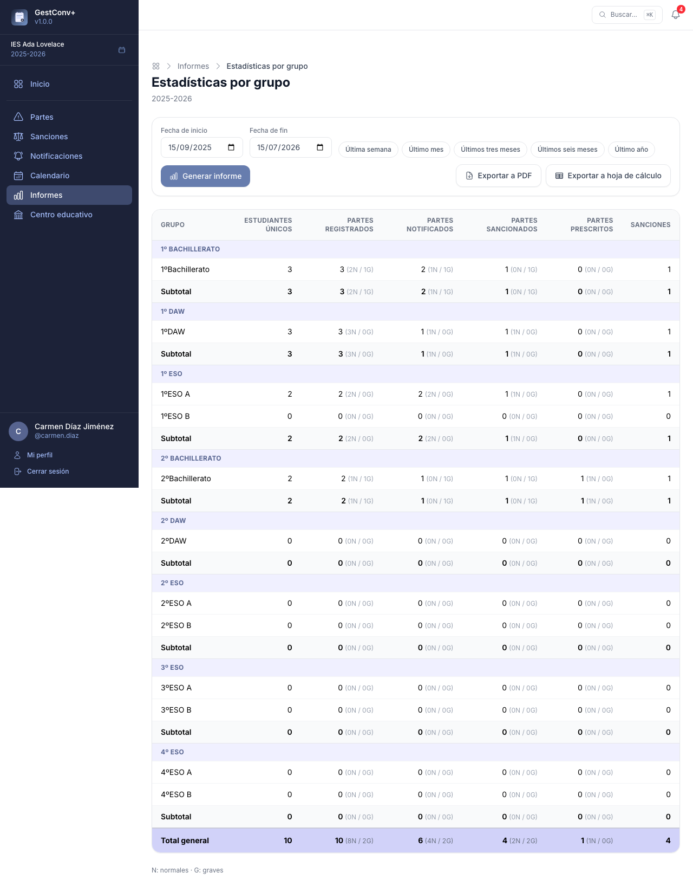
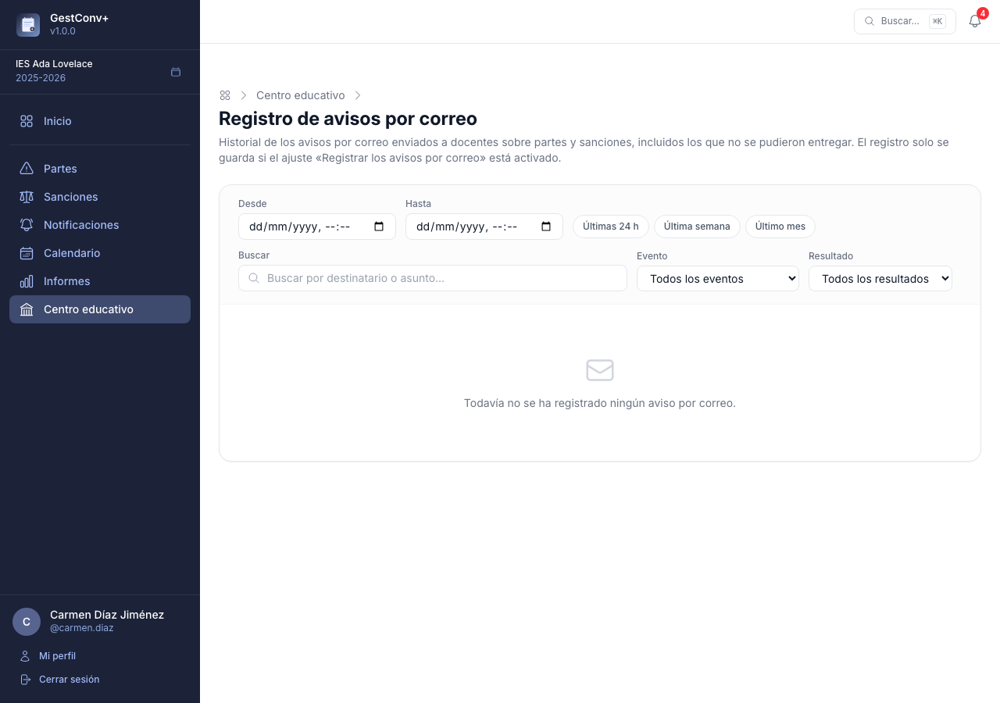

# Administrar el centro educativo

Este capítulo es para quienes administran el centro — normalmente, el **equipo directivo**. La
puesta en marcha de cada curso (profesorado, alumnado, grupos y tutorías) se explica en
[Preparar el curso académico](02-preparar-el-curso-academico.md); aquí se cubre el resto de la
administración: el panel del centro, los catálogos, los ajustes, los informes y los avisos
automáticos por correo.

## El panel del centro educativo

La sección **Centro educativo** del menú lateral es el panel de configuración del centro,
reservado a los administradores. Sus tarjetas dan acceso a los cursos académicos, los docentes,
la oferta formativa, los estudiantes, los catálogos del centro, los perfiles especiales, los
ajustes y el registro de avisos por correo.

Las tarjetas de **Docentes** y **Estudiantes** —altas e importaciones desde Séneca— se explican
paso a paso en [Preparar el curso académico](02-preparar-el-curso-academico.md); el resto, a
continuación.

### Cursos académicos

La tarjeta **Cursos académicos** gestiona los cursos del centro: crearlos, renombrarlos,
eliminarlos y establecer cuál es el activo.

- **Añadir** — un formulario con el nombre del curso (por ejemplo, `2026-2027`) lo crea de
  inmediato.
- **Establecer activo** — cambia el curso activo del centro; a partir de ese momento, los partes,
  sanciones y demás datos nuevos se asocian a él. El curso anterior queda disponible como
  histórico (ver
  [Cambio de curso académico](03-el-trabajo-diario.md#cambio-de-curso-academico-administradores)).
- **Editar** — permite corregir el nombre de un curso.
- **Eliminar** — solo disponible en cursos que no sean el activo.

A diferencia del resto de tarjetas del panel, esta no requiere un curso académico activo para
poder usarse: es precisamente la que permite crear el primero.

### Oferta formativa

La tarjeta **Oferta formativa** abre un editor de dos columnas para el curso académico activo: la
izquierda muestra los cursos del año y la derecha, los grupos del curso seleccionado. Al
seleccionar un curso o un grupo aparece su formulario de edición debajo; los cambios se aplican
al instante, sin recargar la página.

- **Cursos** — cada entrada del año activo (por ejemplo, «1º ESO», «2º Bachillerato»). Desde su
  formulario se puede cambiar el nombre y añadir observaciones.
- **Grupos** — unidades de un curso (por ejemplo, 1ºA, 1ºB). Cada grupo pertenece a un único
  curso, y su formulario permite asignar tutores/as y docentes.

Si el centro no tiene un curso académico activo, la sección muestra un aviso y no permite
gestionar la oferta formativa. El paso a paso completo está en
[Preparar el curso académico](02-preparar-el-curso-academico.md#la-oferta-formativa-a-mano).

### Perfiles

La tarjeta **Perfiles** asigna los dos roles especiales a docentes concretos del centro:

- **Comisión de convivencia** — ven todos los partes del centro y pueden registrar sanciones para
  cualquier estudiante, con los mismos permisos que un administrador de centro sobre partes y
  sanciones.
- **Orientador/a** — ven todos los partes y sanciones del centro, pero no pueden crear, editar ni
  eliminar los que no han registrado ellos mismos.

Ambos perfiles se asignan mediante buscadores de docentes con autocompletado, restringidos al
curso académico activo. Ninguno de los dos concede acceso al resto del panel del centro (oferta
formativa, estudiantes, catálogos…): solo amplían la visibilidad y los permisos sobre partes y
sanciones (ver [Permisos de un vistazo](08-permisos-de-un-vistazo.md)).

## Catálogos del centro

Al crear el centro se configuran automáticamente cuatro catálogos con valores por defecto,
pensados para empezar a trabajar sin más preparación. Conviene revisarlos al menos una vez y
adaptarlos al plan de convivencia del centro. Los cuatro comparten la misma mecánica: cada
elemento se puede **activar o desactivar** (solo los activos aparecen en los formularios), se
reordena con las flechas, y se puede editar o eliminar.

### Conductas contrarias a la convivencia

Se gestionan en **Centro educativo › Conductas contrarias**, organizadas en categorías. Cada
conducta puede marcarse como *grave* o *contraria*. Al crear el centro se configuran **19
conductas por defecto** basadas en la normativa de convivencia escolar de Andalucía, ordenadas de
contrarias a graves.

### Ubicaciones

En **Centro educativo › Ubicaciones** se configura el catálogo de lugares donde puede ocurrir un
incidente, organizado en categorías. Es el que se ofrece en el campo obligatorio **Dónde
sucedió** al registrar un parte (ver
[Registrar un nuevo parte](03-el-trabajo-diario.md#registrar-un-nuevo-parte)). El catálogo por
defecto incluye las ubicaciones más habituales: *En clase*, *En el intercambio de clases*,
*Entrada/Salida*, *Recreo*, *Durante las actividades extraescolares* y *Otros*.

### Medidas disciplinarias

Se gestionan en **Centro educativo › Sanciones › Medidas disciplinarias**, organizadas en
categorías igual que las conductas. Son las medidas que la comisión de convivencia marca al
[registrar una sanción](04-sanciones-y-comision.md#registrar-una-sancion).

### Métodos de comunicación

En **Centro educativo › Métodos de comunicación** se configura la lista —plana, sin categorías—
de vías de contacto con las familias, que se ofrece al
[registrar una comunicación](03-el-trabajo-diario.md#notificaciones). Los 6 métodos por defecto
son: Llamada telefónica, Mensajería Pasen, Correo electrónico, SMS, WhatsApp y Otros.

Un método que ya se ha usado en alguna comunicación no se puede eliminar (aparece un aviso);
desactívalo en su lugar.

### Copiar catálogos entre centros

Los cuatro catálogos incluyen botones **Exportar JSON** e **Importar JSON** para copiar la
configuración de un centro a otro: la exportación descarga un fichero con los elementos y sus
categorías, y la importación lo vuelve a cargar, creando lo que no exista y actualizando el resto
por nombre (sin distinguir mayúsculas). Al importar se puede marcar la opción de **vaciar el
catálogo existente** antes de incorporar el fichero; esta acción no se puede deshacer (los
métodos de comunicación ya usados en alguna comunicación se conservan aunque se marque).

## Ajustes del centro

La tarjeta **Ajustes** del panel abre los ajustes con ámbito de centro: valores que se aplican a
todo el profesorado del centro por encima del valor global del servidor. Los más relevantes para
el día a día:

- **Quién notifica los partes** y **quién notifica las sanciones** — el docente que los registró,
  el tutor/a del grupo o ambos (valor por defecto). Determinan quién puede registrar las
  comunicaciones con las familias (ver
  [Quién puede notificar](03-el-trabajo-diario.md#quien-puede-notificar)).
- **Días para la prescripción automática** y **aviso de prescripción próxima** — controlan las
  dos tareas diarias descritas [más abajo](#prescripcion-automatica-de-partes-sin-notificar).
- **Avisos por correo** — qué eventos de partes y sanciones generan un correo y a quién (ver
  [Avisos de partes y sanciones](#avisos-de-partes-y-sanciones)).
- **Modo tablón** — duraciones de la alternancia de semanas y tema de colores (ver
  [Ajustes del modo tablón](05-calendario-y-tablon.md#ajustes-del-modo-tablon)).
- **Personalización de informes** — encabezados, pies y marca de agua de los PDF (ver
  [Personalización de informes](07-administrar-la-plataforma.md#personalizacion-de-informes)).

La referencia completa de todos los ajustes, con sus rangos y valores por defecto, está en
[Ajustes disponibles](07-administrar-la-plataforma.md#ajustes-disponibles); la mecánica de
niveles (global, centro, docente) y el bloqueo con candado se explican en
[Sistema de ajustes](07-administrar-la-plataforma.md#sistema-de-ajustes).

## Informes

La sección **Informes** del menú lateral reúne los informes agregados de convivencia. Solo la ven
quienes tienen acceso a la sección Centro educativo, y requiere un curso académico activo.

### Estadísticas por grupo

La tarjeta **Estadísticas por grupo** pide una fecha de inicio y una de fin, y genera una tabla
con los partes registrados en ese rango para cada grupo del curso activo, agrupados por curso:

- **Estudiantes únicos** — estudiantes distintos con al menos un parte en el rango.
- **Partes registrados, notificados, sancionados y prescritos** — cada uno desglosado entre
  conductas contrarias y graves.
- **Sanciones** — sanciones distintas asociadas a los partes del grupo; una sanción que agrupe
  varios partes cuenta una sola vez.

Los grupos sin partes también aparecen, con todos los valores a cero. Cada curso muestra una fila
de subtotal y la tabla termina con el total general del centro.

Una vez generado, los botones **Exportar a PDF** y **Exportar a hoja de cálculo** descargan el
mismo contenido en PDF (con el encabezado personalizable del centro, ver
[Personalización de informes](07-administrar-la-plataforma.md#personalizacion-de-informes)) o en
una hoja Excel con una fila por grupo, los subtotales y el total general.

## Avisos de partes y sanciones

Además de las comunicaciones con las familias, la aplicación puede avisar **al profesorado, por
correo electrónico**, de los eventos relevantes de partes y sanciones. Estos avisos están
**desactivados por defecto** y se activan uno a uno desde
[Ajustes](07-administrar-la-plataforma.md#avisos-por-correo), a nivel global o de centro,
eligiendo en cada caso si se notifica a nadie, al docente que registró el elemento, al tutor/a
del grupo o a ambos:

- **Parte registrado, notificado a la familia, modificado, eliminado, prescrito o incorporado a
  una sanción** — seis avisos independientes, uno por evento. El de «modificado» cubre cualquier
  edición del parte salvo marcarlo como prescrito, que tiene su propio aviso. El de «prescrito»
  se envía tanto si un administrador marca el parte manualmente como si prescribe de forma
  automática (ver más abajo).
- **Sanción notificada a la familia** — se avisa al docente que registró cada uno de los partes
  incorporados a la sanción y/o al tutor/a del grupo.
- **Parte sancionable** — cuando un parte queda notificado a la familia y todavía no está
  prescrito ni incorporado a una sanción, puede avisarse a todos los docentes con el perfil de
  comisión de convivencia del centro.

Cada correo enlaza directamente al parte o la sanción correspondiente (salvo el de eliminación,
ya que el elemento deja de existir) e incluye el nombre de quien realizó la acción, salvo el de
prescripción automática, que no tiene un docente asociado.

Dos ajustes adicionales, **Enviar parte adjunto al correo** y **Enviar sanción adjunta al
correo** (desactivados por defecto), añaden el PDF correspondiente como adjunto: el primero a
cualquiera de los seis avisos de parte, el segundo al aviso de sanción notificada. Solo afectan
al correo enviado, no al [registro de avisos](#registro-de-avisos-por-correo).

!!! note "El correo del servidor debe estar activo"
    Para que estos avisos lleguen, el servidor debe tener configurado el envío de correo (ver
    [Correo electrónico del servidor](07-administrar-la-plataforma.md#correo-electronico-del-servidor)).

## Prescripción automática de partes sin notificar

Una tarea programada diaria revisa, para cada centro, los partes que todavía no se han comunicado
a la familia y marca como prescritos los que llevan más días sin notificar que el valor del
ajuste **Días para la prescripción automática** (14 por defecto; 0 para desactivarla). El plazo
se cuenta desde la fecha en la que ocurrió el incidente. Si el aviso de «Parte prescrito» está
activado, se envía igual que si lo hubiera marcado un administrador manualmente, pero sin nombrar
a ningún docente como autor de la acción.

## Aviso de prescripción próxima

Otra tarea programada diaria, independiente de la anterior, avisa con antelación de los partes a
punto de prescribir. Para cada docente que puede notificar partes (según el ajuste **Quién
notifica los partes de convivencia**), revisa los que le corresponden y todavía no se han
comunicado a la familia; si alguno prescribirá en el número de días del ajuste **Aviso de
prescripción próxima** (7 por defecto; 0 para desactivarlo, y cada docente puede fijar su propio
valor) o menos, le envía un único correo con el listado completo de esos partes.

Este aviso nunca incluye partes ya prescritos: solo avisa mientras todavía se puede evitar la
prescripción comunicando el parte a la familia.

## Registro de avisos por correo

Cada envío de los avisos anteriores queda registrado —tanto si se entrega correctamente como si
falla— en un historial visible desde **Centro educativo › Registro de avisos por correo**,
accesible solo para los administradores del centro.

Cada entrada muestra la fecha, el destinatario, el tipo de evento, el asunto y el resultado
(entregado o fallido, con el motivo del error en este último caso). El listado pagina y puede
filtrarse por texto libre (destinatario o asunto), tipo de evento, resultado y rango de fechas,
con accesos rápidos para las últimas 24 horas, la última semana o el último mes.

El registro se activa o desactiva con el ajuste **Registrar los avisos por correo** (activado por
defecto). Al desactivarlo, los avisos se siguen enviando con normalidad; simplemente no queda
constancia de ellos. Este historial no incluye los correos de verificación de email ni de
restablecimiento de contraseña, que no son configurables y no tienen registro propio.

Las entradas se purgan automáticamente pasados los días del ajuste **Retención de los registros**
(90 por defecto, limpieza semanal los domingos a las 3:00). Este mismo ajuste, exclusivamente
global, controla también la retención del
[registro de actividad](07-administrar-la-plataforma.md#registro-de-actividad).
